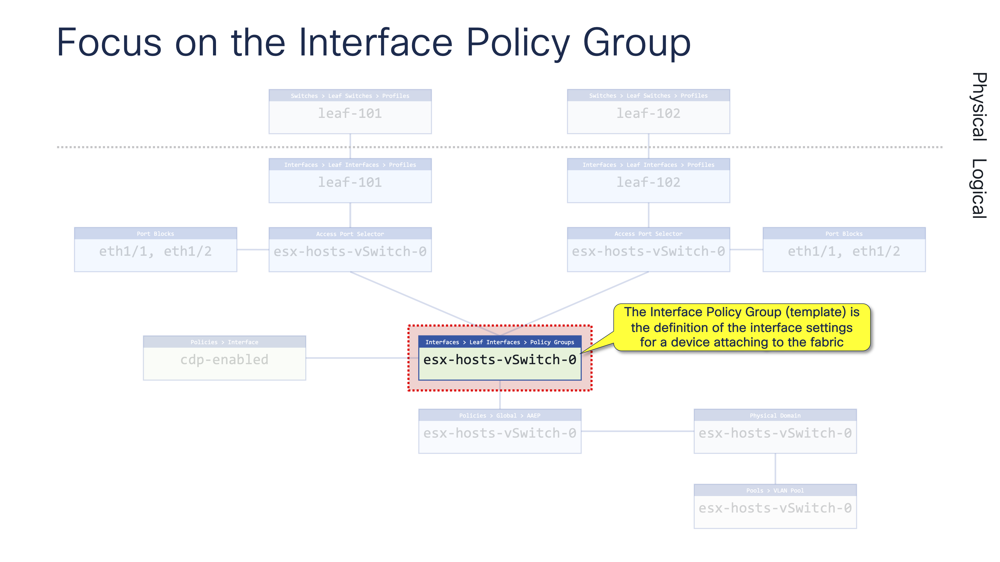
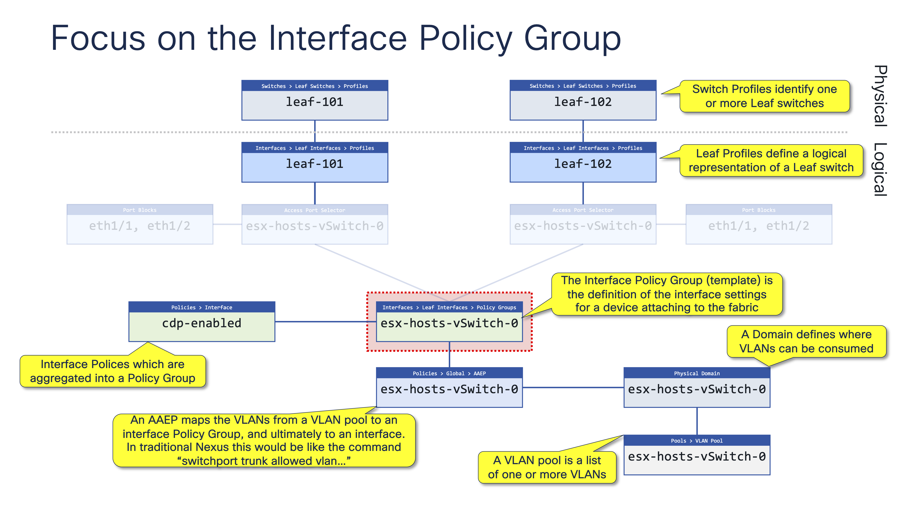

# Access Policy Configuration

Configuring interfaces on an ACI fabric can be very simple (if you know what you're doing), or a bit like driving a car, it can be challenging if you've never been taught properly. I've see many, many customers who have started off configuring things without a real plan in mind, and therein lies one of the most important things to remember when configuring ACI, and that is "plan first, configure second".

Configuring an interface on an ACI Leaf switch is much like configuring an interface on a traditional switch, yes, there are a few other options that you wouldn't find on a traditional switch, and yes, to keep things interesting the developers decided to give objects some funny names, but once you get past that it's really quite simple.

## Access Policy Building Blocks

Before we get onto an actual example it's worth first understanding the building blocks that are ACI Access Policies - be prepared, there are quite a lot of them!

Ok, the first thing to do is to navigate to <span style="color:green">"Fabric > Access Policies"</span>, under the Access Policies you'll find a list of folders where you'll configure your parameters, and at the very top there is a Wizard that's been designed to help you through the configuration steps. 

I would strongly recommend that you never, ever, (ever) use the wizard...!! There a couple of reasons why I would say not to use the wizard, the first being if you use the wizard you will never really learn how to configure interfaces, and the second being that the wizard automatically creates all manner of weird names under the Access Policies.

So what are all these policies?

I'll start at the top and work down, I won't cover every policy else you'll be here forever. If your head starts hurting simply jump to the diagram and example below: 

- **Switches > Leaf Switches > Profiles**: These profiles identify one or more physical switches. In our example a Leaf Switch Profile will map to a single switch
- **Interfaces > Leaf Interfaces > Profiles**: These are the logical representation of physical switches. In our example a Leaf Interface Profile will map 1:1 to a Leaf Switch Profile
- **Interfaces > Leaf Interfaces > Profiles > Access Port Selector**: These are the actual interfaces on a given switch
- **Interfaces > Leaf Interfaces > Policy Groups**: These are a group of settings (an interface template) that will be applied to switch interfaces
- **Policies > Interfaces**: These are the actual interface settings which are aggregated into an Interface Policy Group
- **Policies > Global > AAEP**: In a traditional switch this would be akin to "switchport trunk allowed VLAN" - VLANs are mapped to a Policy Group
- **Domains (L2, L3, Physical, VMM)**: Domains define an environment where VLANs can be consumed. Think, these VLANs can only be used by this tenat
- **Pools > VLAN Pool**: These are lists of one or more VLANs which can be allocated statically or dynamically

Ok, if that's the theory, this is how our Access Policies desing would hang together if I were attaching some ESX hosts to my fabric using standard (non VPC interfaces):

<div class="row" style="display: table;margin: 0 auto">
    
</div>

## Let's build this out step by step...!

The best starting point (IMHO) is to always focus on the Policy Group / Interface Template (call it what you want - well, it's called a Policy Group), because this will be a template which you'll reuse multiple times to ensure that all the switch interfaces are configured in a consistent manner.

<div class="row" style="display: table;margin: 0 auto">
    
</div>

To create an Interface Policy Group, navigate to <span style="color:green">Interfaces > Leaf Interfaces > Policy Groups</span>. Once you're in the right place, create a new Policy Group with the name of the device that you're attaching to the network - in this case we're going to attach the default vSwitch-0 from our hosts, therefore we'll name the Policy Group "**esx-hosts-vSwitch-0**".

When you create the Policy Group you'll quickly realise that you should have created some of the other objects before the Policy Group so that you could use them at this point. Not to worry, you can either create the objects at this point, or just save the empty policy group - we'll do the latter and just save the empty group.

## Let's start (again) at the bottom and work our way up the Object Model...!

We're going to keep our naming structure very (er) structured, everything will reflect the name of the Policy Group.

We will create the following objects:

- A <span style="color:green">VLAN Pool</span> that is type "static" with the VLANs that we want to use for our host connectivity on vSwitch-0
- A <span style="color:green">Physical Domain</span> that could/would be used to control where the VLANs are used
- An <span style="color:green">AAEP</span> that is going to "switchport trunk" allow the VLANs on an interface
- A number of <span style="color:green">Interface Policies</span> which will define the characteristics of our interfaces e.g. cdp-enabled, mcp-enabled, port-local-vlans etc

At each step we need to ensure that the relationship between our objects is in place, because if you have a break in the model the interface won't be configured correctly.

<div class="row" style="display: table;margin: 0 auto">
    
</div>

## Now let's start at the top and work our way down the Object Model...!

The next step will be to map our physical switches to the logical representation of our switches, in other words we will create a 1:1 mapping between our <span style="color:green">Leaf Switch Profile</span> and our <span style="color:green">Leaf Interface Profile</span>.

To do this we will need to create the following objects:

- A <span style="color:green">Leaf Switch Profile</span> this identifies a physical switch, i.e. leaf-101, leaf-102, etc
- A <span style="color:green">Leaf Interface Profile</span> this will map our configured interfaces to our physical switches, i.e. leaf-101, leaf-102, etc

<div class="row" style="display: table;margin: 0 auto">
    
</div>

## Let's complete the Object Model...!

The final thing we need to do is to select which interfaces we want to configure on a particular switch, to do this we will create the two remaining objects:

- An <span style="color:green">Access Port Selector</span> is configured under the Leaf Interface Profile and is used to identify on or more interfaces that will be configured
- A <span style="color:green">Port Block</span> is where you actually specify the interfaces that you want to configure i.e. eth1/1, eth 1/2, etc. You can add a unique interface description to each interface as you configure it, this will be displayed when you enter a "show" command on APIC such as ```fabric 101 show interface status```, or directly on a leaf switch ```show interface status```

<div class="row" style="display: table;margin: 0 auto">
    
</div>

## That seems like a lot of steps to configure an interface...!

This is something that I've heard more than once, and it's true, there are a number of steps that need to be completed, and if we were only configuring a single interface on a single switch this would take some time. However, Data Centers come in all shapes and sizes, and there are always multiple switches - from a small Data Center of 10-20 switches, to a large Data Center with hundreds of switches. Whatever size Data Center you're building, the ability to have a consistent configuration across all your switches is critical.

Once we've build out our Object Model for our vSwitch-0 configuration on our ESX hosts we can reuse the <span style="color:green">Policy Group</span> across as many switches as there are in our Data Center, it's simply a case of creating an <span style="color:green">Access Port Selector</span> with the required interfaces under the <span style="color:green">Leaf Interface Profile</span> wherever you're attaching your hosts.

<div class="row" style="display: table;margin: 0 auto">
    
</div>

## Summary

Configuring interfaces on an ACI fabric is extremely flexible and scalable however (as hard as it is) you should really plan what you're going build before jumping in at the deep end and configuring things.