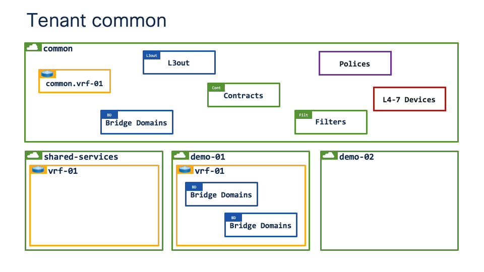

# Working with tenant common

The first thing to say about tenant common (rather than the "common tenant") is that objects which are created in tenant common can be used as a resource by any other (user) tenants. Typical examples of this would be when a "user" tenant contains EPGs and uses a Bridge Domain (and VRF) in tenant common. Another example would be when Contracts are defined in tenant common and consumed as resources in other (user) tenants.

You can think of it that tenant common is "above" other teants as shown below.

<div class="row" style="display: table;margin: 0 auto">
    
</div>

## Security considerations

An important security consideration with tenant common is that it is extremely easy to map objects in "user" tenants to resources in tenant common by mistake. 

To explain why this could happen, lets take an example configuration from our tenant `demo-01`.

Inside tenant `demo-01` there is  a single VRF `vrf-01`, attached to the VRF are various Bridge Domains with their associated SVIs. The VRF in tenant `demo:01` would be referred to as `demo-01:vrf-01`.

If there is a VRF in tenant common with the same name (`vrf-01`) it would be relatively easy to attach a Bridge Domain in the "user" tenant to `vrf-01` in tenant common by mistake using the GUI. 

Whilst making GUI errors can be avoided there is a bigger security concern around the naming of objects. If `demo-01:vrf-01` was deleted all the objects referencing `vrf-01` would automatically bind to `common:vrf-01` as the binding of objects uses the object name **not** the object dn.

## Looking at the code

In the first block of code (fvBD) the distinguished name, or the path to the Bridge Domain is `uni/tn-demo/BD-10.192.168.150.0_24`. The APIC controller is explicitly told how to find and map the Bridge Domain.

The second block of code (fvSubnet) is a child of fvBD and its attributes include the Default Gateway  (`192.168.150.1/24`), and a flag (`scope`) to control whether the subnet is advertised or not.

The third block of code (fvRsCtx) is another child of fvBD and it defines which VRF (`tnFvCtxName`) the Bridge Domain should be bound to. The APIC controller is told to bind to vrf-01, however **critically** there is no reference as to the path to vrf-01, i.e. the VRF is referenced by its actual name, and not its distinguished name.

```json hl_lines="5 22 25 33" title="VRF resolution"
"fvBD": {
    "attributes": {
        "arpFlood": "yes",
        "descr": "",
        "dn": "uni/tn-demo/BD-10.192.168.150.0_24",
        "limitIpLearnToSubnets": "yes",
        "mac": "00:22:BD:F8:19:FF",
        "mcastARPDrop": "yes",
        "mcastAllow": "no",
        "multiDstPktAct": "bd-flood",
        "name": "192.168.150.0_24",
        "unicastRoute": "yes",
        "unkMacUcastAct": "proxy",
        "unkMcastAct": "flood",
        "userdom": ":all:mgmt:common:"
    },
    "children": [
        {
            "fvSubnet": {
                "attributes": {
                    "descr": "",
                    "ip": "192.168.150.1/24",
                    "ipDPLearning": "enabled",
                    "preferred": "no",
                    "scope": "private",
                    "userdom": ":all:mgmt:common:"
                }
            }
        },
        {
            "fvRsCtx": {
                "attributes": {
                    "tnFvCtxName": "vrf-01",
                    "userdom": "all"
                }
            }
        }
    ]
}
```

## Recommendation

A general recommendation would be to prefix objects in tenant common to prevent unexpected binding of resources:

---
| object | name |
| --- | ---
| vrf: | common.vrf-01 |
| bd:  | common.vrf-01_10.237.100.0_24 |
| l3out: | common.vrf-01-ospf-area-0.0.0.1 |
| contract: | common.permit-tcp-src-any-dst-80 |
| filter: | common.tcp-src-any-dst-80 |
| policy: | common.dhcp-server |
| device: | common.ftd-01 |
