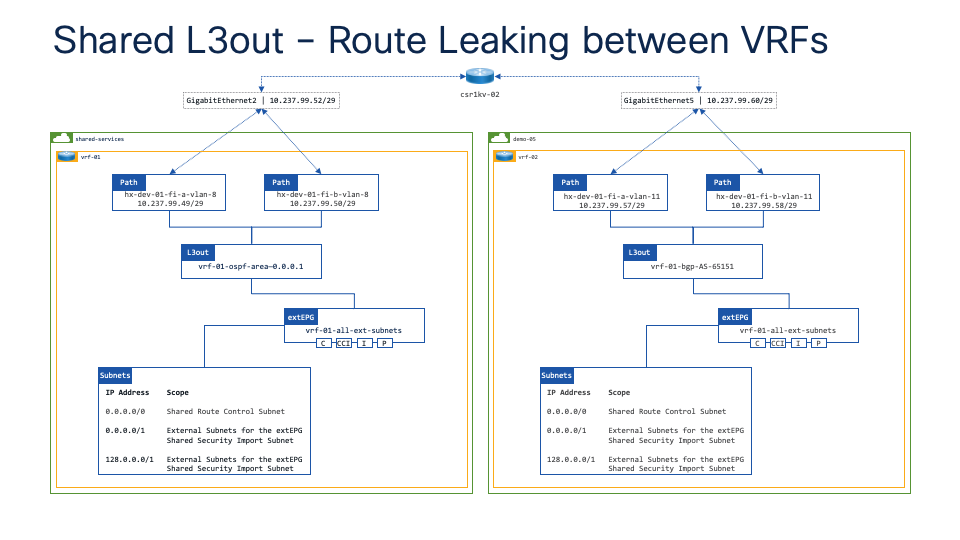

# Configuring BGP from an external router to ACI

This is the basic configuration that I put together to peer a csr1kv to ACI such that the csr1kv provides routing between "shared-services" tenant running OSPF and a tenant running BGP.

<div class="row" style="display: table;margin: 0 auto">
    
</div>

## Basic configuration

Configure a dedicated VRF for management traffic

```console
vrf definition management
 
 address-family ipv4
 exit-address-family

interface GigabitEthernet1
 vrf forwarding management
 ip address 10.237.100.127 255.255.255.0
 negotiation auto
 no mop enabled
 no mop sysid

ip route vrf management 0.0.0.0 0.0.0.0 10.237.100.1
```

Configure OSPF to peer with upstream routers

```console
interface GigabitEthernet2
 ip address 10.237.99.52 255.255.255.248
 negotiation auto
 no mop enabled
 no mop sysid

router ospf 1
 network 10.237.99.48 0.0.0.7 area 0.0.0.1
```

Configure BGP on the upstream router to peer with ACI fabric

```console
interface GigabitEthernet5
 ip address 10.237.99.60 255.255.255.248
 negotiation auto
 no mop enabled
 no mop sysid

router bgp 65051
 bgp log-neighbor-changes
 neighbor 10.237.99.57 remote-as 65151
 neighbor 10.237.99.58 remote-as 65151
 
 address-family ipv4
  network 0.0.0.0
  network 10.237.99.56 mask 255.255.255.248
  redistribute ospf 1 match external 2
  neighbor 10.237.99.57 activate
  neighbor 10.237.99.58 activate
 exit-address-family
```

In this example I've used the ```network 0.0.0.0``` statement which will look in the routing table for a default route and then advertise in BGP. 

Note: If a default route has been learned as an external route from OSPF it will **not** be redistributed into BGP using ```redistribute ospf 1 match external 2```.

Another example would be to use ```default-information originate``` with ```neighbor x.x.x.x default-originate``` this would always create a default route and advertise it via BGP to the specified neighbours.

```console
router bgp 65051
 bgp log-neighbor-changes
 neighbor 10.237.99.57 remote-as 65151
 neighbor 10.237.99.58 remote-as 65151

 address-family ipv4
  network 10.237.99.56 mask 255.255.255.248
  neighbor 10.237.99.57 activate
  neighbor 10.237.99.57 default-originate
  neighbor 10.237.99.58 activate
  neighbor 10.237.99.58 default-originate
  default-information originate
 exit-address-family
```

## Part 2 - Creating a tenant specific VRF on the upstream router

Define a new VRF:

```console
vrf definition tn-demo-05
 rd 65005:5
 route-target export 65005:5
 route-target import 65005:5

 address-family ipv4
 exit-address-family
 ```

Add interface to the VRF and configure BGP:

```console
interface GigabitEthernet5
 vrf forwarding tn-demo-05
 ip address 10.237.99.60 255.255.255.248
 negotiation auto
 no mop enabled
 no mop sysid

router bgp 65051
 bgp log-neighbor-changes
 
 address-family ipv4 vrf tn-demo-05
  network 0.0.0.0
  network 10.237.99.56 mask 255.255.255.248
  neighbor 10.237.99.57 remote-as 65151
  neighbor 10.237.99.57 activate
  neighbor 10.237.99.58 remote-as 65151
  neighbor 10.237.99.58 activate
 exit-address-family
```

### Useful commands

show ip bgp all summary
show ip route vrf tn-demo-05
show ip bgp vpnv4 rd 65005:05
show ip bgp vpnv4 vrf tn-demo-05
show bgp vrf tn-demo-05 neighbors


need to redistribute ospf to bgp vrf

### create default VRF on csr1kv-02

vrf definition default
 
 address-family ipv4
 exit-address-family

interface GigabitEthernet2
 vrf forwarding default
 ip address 10.237.99.52 255.255.255.248
 negotiation auto
 no mop enabled
 no mop sysid

router ospf 1 vrf default
 network 10.237.99.48 0.0.0.7 area 0.0.0.1

### Working configuration with default VRF

vrf definition default
 rd 65000:100
 route-target export 65000:100
 route-target import 65000:100

 address-family ipv4
 exit-address-family

interface GigabitEthernet2
 vrf forwarding default
 ip address 10.237.99.52 255.255.255.248
 negotiation auto
 no mop enabled
 no mop sysid

interface GigabitEthernet5
 vrf forwarding default
 ip address 10.237.99.60 255.255.255.248
 negotiation auto
 no mop enabled
 no mop sysid
router ospf 1 vrf default
 capability vrf-lite
 redistribute bgp 65051
 network 10.237.99.48 0.0.0.7 area 0.0.0.1

router bgp 65051
 bgp log-neighbor-changes

 address-family ipv4 vrf default
  network 0.0.0.0
  network 10.237.99.56 mask 255.255.255.248
  redistribute ospf 1 match external 2
  neighbor 10.237.99.57 remote-as 65151
  neighbor 10.237.99.57 activate
  neighbor 10.237.99.58 remote-as 65151
  neighbor 10.237.99.58 activate
 exit-address-family

### Working configuration with multiple VRFs

vrf definition default
 rd 65000:100
 route-target export 65000:100
 route-target import 65000:100
 route-target import 65005:5
 !
 address-family ipv4
 exit-address-family
!
vrf definition management
 !
 address-family ipv4
 exit-address-family
!
vrf definition tn-demo-05
 rd 65005:5
 route-target export 65005:5
 route-target import 65005:5
 route-target import 65000:100
 !
 address-family ipv4
 exit-address-family

interface GigabitEthernet2
 vrf forwarding default
 ip address 10.237.99.52 255.255.255.248
 negotiation auto
 no mop enabled
 no mop sysid

interface GigabitEthernet5
 vrf forwarding tn-demo-05
 ip address 10.237.99.60 255.255.255.248
 negotiation auto
 no mop enabled
 no mop sysid

router ospf 1 vrf default
 capability vrf-lite
 network 10.237.99.48 0.0.0.7 area 0.0.0.1
!
router bgp 65051
 bgp log-neighbor-changes
 !
 address-family ipv4 vrf default
  redistribute connected
  redistribute ospf 1 match internal external 1 external 2
 exit-address-family
 !
 address-family ipv4 vrf tn-demo-05
  network 0.0.0.0
  network 10.237.99.56 mask 255.255.255.248
  neighbor 10.237.99.57 remote-as 65151
  neighbor 10.237.99.57 activate
  neighbor 10.237.99.58 remote-as 65151
  neighbor 10.237.99.58 activate