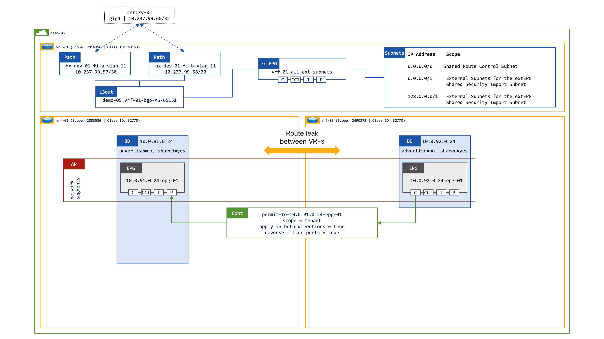
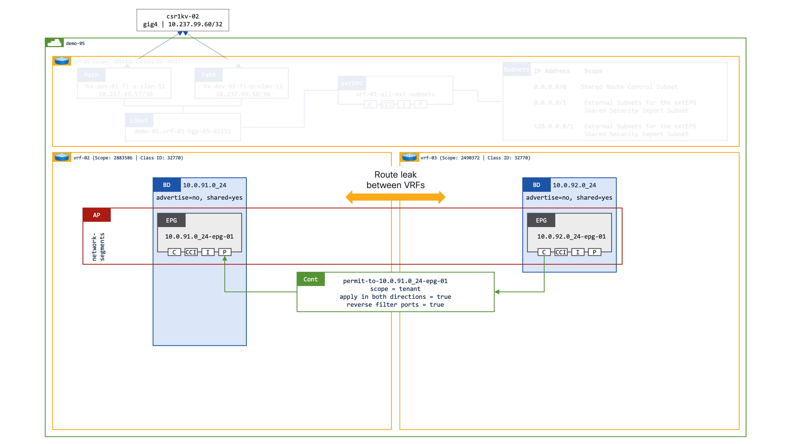
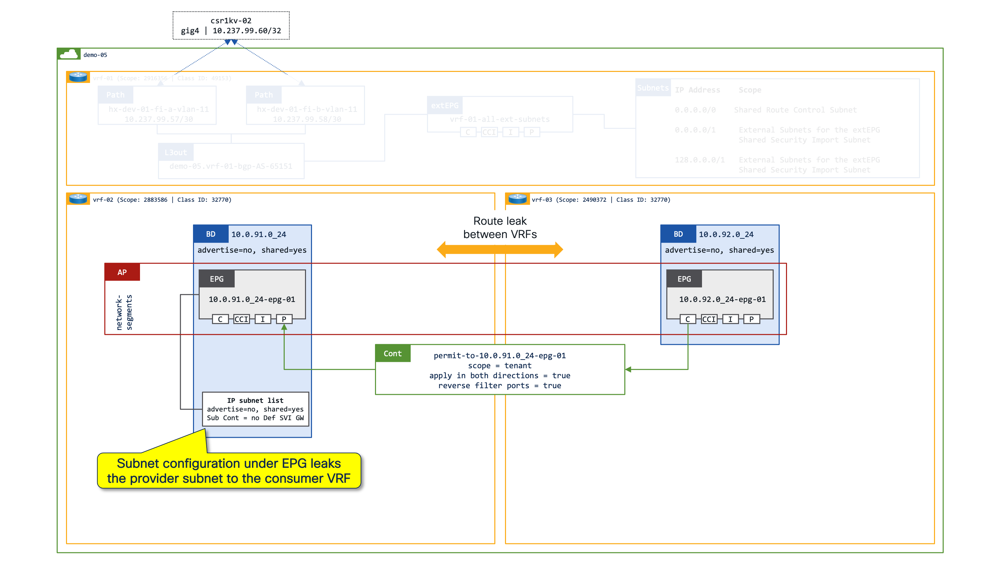
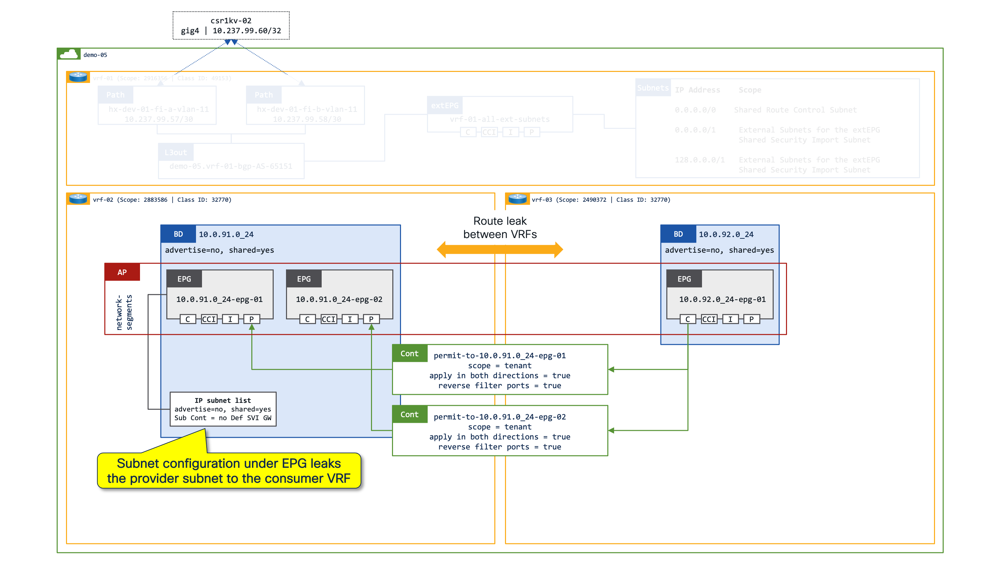
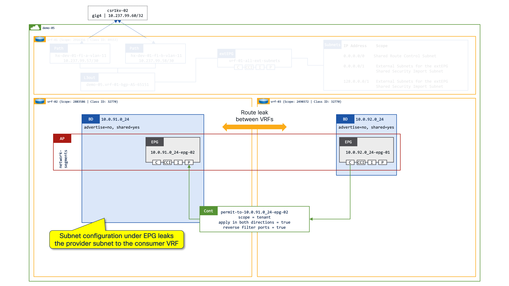

# Route Leaking with EPGs - (draft)

Why would you want to leak routes between tenants?

I guess there are a number of different reasons why you might want to leak routes between tenants, it could be that you're creating a private cloud shared-services design - you can see an example of this in the [tenant design options](../tenant-design-options/index.md), or it could be that you want more control with vzAny - have a look at [working with vzAny](../vzAny/index.md), or it could be that you simply want to share common services between differnt VRFs/Tenants. 

Whatever the reason, leaking routes is very straightforward to do.

!!! info 
    As always, I tend to avoid using tenant `common` unless I'm configuring a resource which must be a shared amongst other tenants. 

## Our tenant

For the purposes of this write up we're going to use Tenant `demo-05` which has 3x VRFs:

- VRF-01: This is the external facing VRF which has a L3out to a csr1kv
- VRF-02: This is an internal VRF which has the `10.0.91.0/24` Bridge Domain and associated EPGs
- VRF-03: This is an internal VRF which has the `10.0.92.0/24` Bridge Domain and associated EPGs

You might be wondering why I'm using tenant `demo-05`, the answer is simply that my other demo tenants are being used for other demos :)

<div class="row" style="display: table;margin: 0 auto">
    
</div>

!!! info 
    It's **very important** to note the different Scopes and Class IDs/pcTags of the various objects. 
    
    The values of the Class IDs/pcTags will change from a VRF significant range to a globally significant range when creating shared services between different VRFs.

??? note "pcTag Ranges"

    ---
    | pcTag Category | pcTag Range |
    | ---            | ---         |
    | System | 1-15	|
    | Locally significant | 16-16385 |
    | Globally significant | 16386-65535 | 

## Internal Route Leaking

To start with we will just focus on internal route leaking between VRF-02 and VRF-03.

<div class="row" style="display: table;margin: 0 auto">
    
</div>

Each of the VRFs contains a single Bridge Domain, with a single EPG - a traditional "Network Centric" design. There is a contract in place between the EPGs, with `10.0.91.0_24-epg-01` **providing** the contract, and `10.0.92.0_24-epg-01` **consuming** the contract.

The contract is a basic contract which allows connections from any source port to any destination port i.e. it will be possible to establish connections from the consumer to the provider, and from the provider to the consumer.

It's important to note that the Scope of the contract is set to `tenant` as all the VRFs in question are in the same tenant. If the VRFs in question were in different tenants the Scope of the contract would need to be set to `global`.

??? success "Contract configuration with NAC"
    ``` yaml
    ---
    apic:
    tenants:
        - name: demo-05
          description: Routable IP range 10.0.91-92.x

          filters:
            - name: 'permit-src-any-dst-any'
              entries:
              - name: 'permit-src-any-dst-any'
                ethertype: unspecified

          contracts:
            - name: permit-to-10.0.91.0_24-epg-01
              scope: tenant
              subjects:
                - name: permit-src-any-dst-any
                    filters:
                    - filter: permit-src-any-dst-any
    ```
### Provider Routing Table

If we have a look at the Provider VRF (`demo-05:vrf-02`) we can see that subnet `10.0.92.0/24` has been leaked from the Consumer VRF (`demo-05:vrf-03`) into the Provider VRF.

We can also see the VXLAN ID (Scope) of the Consumer VRF (`vxlan-2490372`).

???+ success "Provider Routing Table (`demo-05:vrf-02`)"
    ``` code hl_lines="15 16 31 32"
    aci-dev-01-apic-01# fabric 101-102 show ip route vrf demo-05:vrf-02
    ----------------------------------------------------------------
     Node 101 (aci-dev-01-leaf-101)
    ----------------------------------------------------------------
    IP Route Table for VRF "demo-05:vrf-02"
    '*' denotes best ucast next-hop
    '**' denotes best mcast next-hop
    '[x/y]' denotes [preference/metric]
    '%<string>' in via output denotes VRF <string>
    
    10.0.91.0/24, ubest/mbest: 1/0, attached, direct, pervasive
        *via 10.1.176.66%overlay-1, [1/0], 2d19h, static, tag 4294967294
    10.0.91.1/32, ubest/mbest: 1/0, attached, pervasive
        *via 10.0.91.1, vlan30, [0/0], -02w04d, local, local
    10.0.92.0/24, ubest/mbest: 1/0, attached, direct, pervasive
        *via 10.1.176.66%overlay-1, [1/0], 01:15:13, static, tag 4294967294, rwVnid: vxlan-2490372
    
    ----------------------------------------------------------------
     Node 102 (aci-dev-01-leaf-102)
    ----------------------------------------------------------------
    IP Route Table for VRF "demo-05:vrf-02"
    '*' denotes best ucast next-hop
    '**' denotes best mcast next-hop
    '[x/y]' denotes [preference/metric]
    '%<string>' in via output denotes VRF <string>
    
    10.0.91.0/24, ubest/mbest: 1/0, attached, direct, pervasive
        *via 10.1.176.66%overlay-1, [1/0], 2d19h, static, tag 4294967294
    10.0.91.1/32, ubest/mbest: 1/0, attached, pervasive
        *via 10.0.91.1, vlan152, [0/0], -02w04d, local, local
    10.0.92.0/24, ubest/mbest: 1/0, attached, direct, pervasive
        *via 10.1.176.66%overlay-1, [1/0], 01:15:15, static, tag 4294967294, rwVnid: vxlan-2490372
    
    aci-dev-01-apic-01#
    ```

### Provider Zoning Rules

If we have a look at the Provider Zoning Rules we can see that there is a zoning rule in place between SrcEPG 5503 and DstEPG 14.

???+ success "Provider Zoning Rules (`demo-05:vrf-02 | Scoope 2883586`)"
    ``` code hl_lines="12 25"
        aci-dev-01-apic-01# fabric 101-102 show zoning-rule scope 2883586
        ----------------------------------------------------------------
        Node 101 (aci-dev-01-leaf-101)
        ----------------------------------------------------------------
        +---------+--------+--------+----------+---------+---------+---------+------+-----------------+----------------------+
        | Rule ID | SrcEPG | DstEPG | FilterID |   Dir   |  operSt |  Scope  | Name |      Action     |       Priority       |
        +---------+--------+--------+----------+---------+---------+---------+------+-----------------+----------------------+
        |   5022  |   0    |   15   | implicit | uni-dir | enabled | 2883586 |      |     deny,log    | any_vrf_any_deny(22) |
        |   5040  |   0    |   0    | implarp  | uni-dir | enabled | 2883586 |      |      permit     |  any_any_filter(17)  |
        |   5008  |   0    | 16386  | implicit | uni-dir | enabled | 2883586 |      |      permit     |    src_dst_any(9)    |
        |   5045  |   0    |   0    | implicit | uni-dir | enabled | 2883586 |      |     deny,log    |   any_any_any(21)    |
        |   4729  |  5503  |   14   | implicit | uni-dir | enabled | 2883586 |      | permit_override |    src_dst_any(9)    |
        +---------+--------+--------+----------+---------+---------+---------+------+-----------------+----------------------+

        ----------------------------------------------------------------
        Node 102 (aci-dev-01-leaf-102)
        ----------------------------------------------------------------
        +---------+--------+--------+----------+---------+---------+---------+------+-----------------+----------------------+
        | Rule ID | SrcEPG | DstEPG | FilterID |   Dir   |  operSt |  Scope  | Name |      Action     |       Priority       |
        +---------+--------+--------+----------+---------+---------+---------+------+-----------------+----------------------+
        |   4960  |   0    | 16386  | implicit | uni-dir | enabled | 2883586 |      |      permit     |    src_dst_any(9)    |
        |   4669  |   0    |   0    | implicit | uni-dir | enabled | 2883586 |      |     deny,log    |   any_any_any(21)    |
        |   4941  |   0    |   0    | implarp  | uni-dir | enabled | 2883586 |      |      permit     |  any_any_filter(17)  |
        |   4485  |   0    |   15   | implicit | uni-dir | enabled | 2883586 |      |     deny,log    | any_vrf_any_deny(22) |
        |   4767  |  5503  |   14   | implicit | uni-dir | enabled | 2883586 |      | permit_override |    src_dst_any(9)    |
        +---------+--------+--------+----------+---------+---------+---------+------+-----------------+----------------------+

        aci-dev-01-apic-01#
    ```

??? success "Show Provider EPG details"
    ``` code hl_lines="10 13"
        aci-dev-01-apic-01# show epg 10.0.91.0_24-epg-01 detail
        Application EPg Data:
        Tenant                       : demo-05
        Application                  : network-segments
        AEPg                         : 10.0.91.0_24-epg-01
        BD                           : 10.0.91.0_24
        uSeg EPG                     : no
        Intra EPG Isolation          : unenforced
        Proxy ARP                    : none
        Policy Tag                   : 5503
        Vlan Domains                 :
        Consumed Contracts           :
        Provided Contracts           : permit-to-10.0.91.0_24-epg-01
        Consumed Contracts Interface :
        Denied Contracts             :
        Qos Class                    : unspecified
        Tag List                     :
    ```

### Consumer Routing Table

If we have a look at the Consumer VRF (`demo-05:vrf-03`) we can see that subnet `10.0.91.0/24` has **not** been leaked from the Provider VRF (`demo-05:vrf-02`) into the Consumer VRF.

The Consumer VRF only has it's locally connected subnets.

???+ success "Consumer Routing Table (`demo-05:vrf-02`)"
    ``` code hl_lines="11-14 25-28"
        aci-dev-01-apic-01# fabric 101-102 show ip route vrf demo-05:vrf-03
        ----------------------------------------------------------------
        Node 101 (aci-dev-01-leaf-101)
        ----------------------------------------------------------------
        IP Route Table for VRF "demo-05:vrf-03"
        '*' denotes best ucast next-hop
        '**' denotes best mcast next-hop
        '[x/y]' denotes [preference/metric]
        '%<string>' in via output denotes VRF <string>

        10.0.92.0/24, ubest/mbest: 1/0, attached, direct, pervasive
            *via 10.1.176.66%overlay-1, [1/0], 2d20h, static, tag 4294967294
        10.0.92.1/32, ubest/mbest: 1/0, attached, pervasive
            *via 10.0.92.1, vlan28, [0/0], -02w04d, local, local

        ----------------------------------------------------------------
        Node 102 (aci-dev-01-leaf-102)
        ----------------------------------------------------------------
        IP Route Table for VRF "demo-05:vrf-03"
        '*' denotes best ucast next-hop
        '**' denotes best mcast next-hop
        '[x/y]' denotes [preference/metric]
        '%<string>' in via output denotes VRF <string>

        10.0.92.0/24, ubest/mbest: 1/0, attached, direct, pervasive
            *via 10.1.176.66%overlay-1, [1/0], 2d20h, static, tag 4294967294
        10.0.92.1/32, ubest/mbest: 1/0, attached, pervasive
            *via 10.0.92.1, vlan147, [0/0], -02w04d, local, local

        aci-dev-01-apic-01#
    ```

### Consumer Zoning Rules

If we have a look at the Consumer Zoning Rules we can see that there is are zoning rules in place between SrcEPG 5503 and DstEPG 16386.

???+ success "Consumer Zoning Rules (`demo-05:vrf-03 | Scoope 2490372`)"
    ``` code hl_lines="13 14 28 29"
        aci-dev-01-apic-01# fabric 101-102 show zoning-rule scope 2490372
        ----------------------------------------------------------------
        Node 101 (aci-dev-01-leaf-101)
        ----------------------------------------------------------------
        +---------+--------+--------+----------+----------------+---------+---------+---------------------------------------+----------+------------------------+
        | Rule ID | SrcEPG | DstEPG | FilterID |      Dir       |  operSt |  Scope  |                  Name                 |  Action  |        Priority        |
        +---------+--------+--------+----------+----------------+---------+---------+---------------------------------------+----------+------------------------+
        |   5052  |   0    | 32771  | implicit |    uni-dir     | enabled | 2490372 |                                       |  permit  |     src_dst_any(9)     |
        |   5015  |   0    |   0    | implarp  |    uni-dir     | enabled | 2490372 |                                       |  permit  |   any_any_filter(17)   |
        |   4983  |   0    |   15   | implicit |    uni-dir     | enabled | 2490372 |                                       | deny,log |  any_vrf_any_deny(22)  |
        |   4331  |   0    |   0    | implicit |    uni-dir     | enabled | 2490372 |                                       | deny,log |    any_any_any(21)     |
        |   4840  |  5503  |   0    | implicit |    uni-dir     | enabled | 2490372 |                                       | deny,log | shsrc_any_any_deny(12) |
        |   4389  |  5503  | 16386  | default  | uni-dir-ignore | enabled | 2490372 | demo-05:permit-to-10.0.91.0_24-epg-01 |  permit  |     src_dst_any(9)     |
        |   4749  | 16386  |  5503  | default  |     bi-dir     | enabled | 2490372 | demo-05:permit-to-10.0.91.0_24-epg-01 |  permit  |     src_dst_any(9)     |
        +---------+--------+--------+----------+----------------+---------+---------+---------------------------------------+----------+------------------------+

        ----------------------------------------------------------------
        Node 102 (aci-dev-01-leaf-102)
        ----------------------------------------------------------------
        +---------+--------+--------+----------+----------------+---------+---------+---------------------------------------+----------+------------------------+
        | Rule ID | SrcEPG | DstEPG | FilterID |      Dir       |  operSt |  Scope  |                  Name                 |  Action  |        Priority        |
        +---------+--------+--------+----------+----------------+---------+---------+---------------------------------------+----------+------------------------+
        |   4778  |   0    |   0    | implarp  |    uni-dir     | enabled | 2490372 |                                       |  permit  |   any_any_filter(17)   |
        |   4101  |   0    | 32771  | implicit |    uni-dir     | enabled | 2490372 |                                       |  permit  |     src_dst_any(9)     |
        |   4948  |   0    |   0    | implicit |    uni-dir     | enabled | 2490372 |                                       | deny,log |    any_any_any(21)     |
        |   4704  |   0    |   15   | implicit |    uni-dir     | enabled | 2490372 |                                       | deny,log |  any_vrf_any_deny(22)  |
        |   4698  |  5503  |   0    | implicit |    uni-dir     | enabled | 2490372 |                                       | deny,log | shsrc_any_any_deny(12) |
        |   4275  | 16386  |  5503  | default  |     bi-dir     | enabled | 2490372 | demo-05:permit-to-10.0.91.0_24-epg-01 |  permit  |     src_dst_any(9)     |
        |   4808  |  5503  | 16386  | default  | uni-dir-ignore | enabled | 2490372 | demo-05:permit-to-10.0.91.0_24-epg-01 |  permit  |     src_dst_any(9)     |
        +---------+--------+--------+----------+----------------+---------+---------+---------------------------------------+----------+------------------------+

        aci-dev-01-apic-01#
    ```

??? success "Show Provider EPG details"
    ``` code hl_lines="10 13"
        aci-dev-01-apic-01# show epg 10.0.92.0_24-epg-01 detail
        Application EPg Data:
        Tenant                       : demo-05
        Application                  : network-segments
        AEPg                         : 10.0.92.0_24-epg-01
        BD                           : 10.0.92.0_24
        uSeg EPG                     : no
        Intra EPG Isolation          : unenforced
        Proxy ARP                    : none
        Policy Tag                   : 16386
        Vlan Domains                 :
        Consumed Contracts           : permit-to-10.0.91.0_24-epg-01
        Provided Contracts           :
        Consumed Contracts Interface :
        Denied Contracts             :
        Qos Class                    : unspecified
        Tag List                     :
    ```

!!! info 
    Leaking a subnet from the Consumer VRF to the Provider VRF simply requires that there is a Contract in place between the EPGs, and that the Bridge Domain in the Consumer VRF is marked as `shared between VRFs`

## Leaking the Provider Subnet to the Consumer VRF - option 1

There are a couple of options to leak the Provider subnet to the Consumer VRF, the first option involves defining addresses under the Provider EPG. The norm is to create the entire subnet/gateway under the Provider EPG, however it is also possible to create /32 host routes.

<div class="row" style="display: table;margin: 0 auto">
    
</div>

??? success "EPG with subnet configuration with NAC"
    ``` yaml
    ---
        apic:
        tenants:
            - name: demo-05
            description: Routable IP range 10.0.91-92.x

            application_profiles:
                - name: 'network-segments'
                description: EPGs provide the VLAN backing for application workloads
                endpoint_groups:      
                    - name: '10.0.91.0_24-epg-01'
                    alias: internal-vrf-02
                    bridge_domain: 10.0.91.0_24
                    vmware_vmm_domains:
                        - name: 'hx-dev-01-vds-01'
                        u_segmentation: false
                        deployment_immediacy: immediate
                        resolution_immediacy: immediate
                    subnets:
                        - ip: 10.0.91.1/24
                        public: false
                        private: false
                        shared: true
                        no_default_gateway: false
                    contracts:
                        consumers:
                        imported_consumers:
                        providers:
                        - permit-to-10.0.91.0_24-epg-01
    ```

### Consumer Routing Table

If we have a look at the Consumer VRF (`demo-05:vrf-03`) we can see that subnet `10.0.91.0/24` has **now** been leaked from the Provider VRF (`demo-05:vrf-02`) into the Consumer VRF.

???+ success "Consumer Routing Table (`demo-05:vrf-03`)"
    ``` code hl_lines="11-12 27-28"
        aci-dev-01-apic-01# fabric 101-102 show ip route vrf demo-05:vrf-03
        ----------------------------------------------------------------
        Node 101 (aci-dev-01-leaf-101)
        ----------------------------------------------------------------
        IP Route Table for VRF "demo-05:vrf-03"
        '*' denotes best ucast next-hop
        '**' denotes best mcast next-hop
        '[x/y]' denotes [preference/metric]
        '%<string>' in via output denotes VRF <string>

        10.0.91.0/24, ubest/mbest: 1/0, attached, direct, pervasive
            *via 10.1.176.66%overlay-1, [1/0], 00:00:26, static, tag 4294967294, rwVnid: vxlan-2883586
        10.0.92.0/24, ubest/mbest: 1/0, attached, direct, pervasive
            *via 10.1.176.66%overlay-1, [1/0], 2d20h, static, tag 4294967294
        10.0.92.1/32, ubest/mbest: 1/0, attached, pervasive
            *via 10.0.92.1, vlan28, [0/0], -02w04d, local, local

        ----------------------------------------------------------------
        Node 102 (aci-dev-01-leaf-102)
        ----------------------------------------------------------------
        IP Route Table for VRF "demo-05:vrf-03"
        '*' denotes best ucast next-hop
        '**' denotes best mcast next-hop
        '[x/y]' denotes [preference/metric]
        '%<string>' in via output denotes VRF <string>

        10.0.91.0/24, ubest/mbest: 1/0, attached, direct, pervasive
            *via 10.1.176.66%overlay-1, [1/0], 00:00:28, static, tag 4294967294, rwVnid: vxlan-2883586
        10.0.92.0/24, ubest/mbest: 1/0, attached, direct, pervasive
            *via 10.1.176.66%overlay-1, [1/0], 2d20h, static, tag 4294967294
        10.0.92.1/32, ubest/mbest: 1/0, attached, pervasive
            *via 10.0.92.1, vlan147, [0/0], -02w04d, local, local

        aci-dev-01-apic-01#
    ```

### Considerations when creating the Subnet/Gateway under the EPG

There is a major consideration which must be factored in when configuring route leaking with the subnet under the EPG, and that is the situation when there are multiple EPGs on a Bridge Domain.

Consider the diagram below, the Provider Bridge Domain now supports 2x EPGs `10.0.91.0_24-epg-01` and `10.0.91.0_24-epg-02`, both EPGs Provide unique contracts which are Consumed by EPG `10.0.92.0_24-epg-01`.

<div class="row" style="display: table;margin: 0 auto">
    
</div>

#### Provider Zoning Rules
???+ success "Provider Zoning Rules (`demo-05:vrf-02 | Scoope 2883586`)"
    ``` code hl_lines="12-13 26-27"
        aci-dev-01-apic-01# fabric 101-102 show zoning-rule scope 2883586
        ----------------------------------------------------------------
        Node 101 (aci-dev-01-leaf-101)
        ----------------------------------------------------------------
        +---------+--------+--------+----------+---------+---------+---------+------+-----------------+----------------------+
        | Rule ID | SrcEPG | DstEPG | FilterID |   Dir   |  operSt |  Scope  | Name |      Action     |       Priority       |
        +---------+--------+--------+----------+---------+---------+---------+------+-----------------+----------------------+
        |   5022  |   0    |   15   | implicit | uni-dir | enabled | 2883586 |      |     deny,log    | any_vrf_any_deny(22) |
        |   5040  |   0    |   0    | implarp  | uni-dir | enabled | 2883586 |      |      permit     |  any_any_filter(17)  |
        |   5008  |   0    | 16386  | implicit | uni-dir | enabled | 2883586 |      |      permit     |    src_dst_any(9)    |
        |   5045  |   0    |   0    | implicit | uni-dir | enabled | 2883586 |      |     deny,log    |   any_any_any(21)    |
        |   4840  |  5503  |   14   | implicit | uni-dir | enabled | 2883586 |      | permit_override |    src_dst_any(9)    |
        |   5004  | 10968  |   14   | implicit | uni-dir | enabled | 2883586 |      | permit_override |    src_dst_any(9)    |
        +---------+--------+--------+----------+---------+---------+---------+------+-----------------+----------------------+

        ----------------------------------------------------------------
        Node 102 (aci-dev-01-leaf-102)
        ----------------------------------------------------------------
        +---------+--------+--------+----------+---------+---------+---------+------+-----------------+----------------------+
        | Rule ID | SrcEPG | DstEPG | FilterID |   Dir   |  operSt |  Scope  | Name |      Action     |       Priority       |
        +---------+--------+--------+----------+---------+---------+---------+------+-----------------+----------------------+
        |   4960  |   0    | 16386  | implicit | uni-dir | enabled | 2883586 |      |      permit     |    src_dst_any(9)    |
        |   4669  |   0    |   0    | implicit | uni-dir | enabled | 2883586 |      |     deny,log    |   any_any_any(21)    |
        |   4941  |   0    |   0    | implarp  | uni-dir | enabled | 2883586 |      |      permit     |  any_any_filter(17)  |
        |   4485  |   0    |   15   | implicit | uni-dir | enabled | 2883586 |      |     deny,log    | any_vrf_any_deny(22) |
        |   4698  |  5503  |   14   | implicit | uni-dir | enabled | 2883586 |      | permit_override |    src_dst_any(9)    |
        |   4279  | 10968  |   14   | implicit | uni-dir | enabled | 2883586 |      | permit_override |    src_dst_any(9)    |
        +---------+--------+--------+----------+---------+---------+---------+------+-----------------+----------------------+

        aci-dev-01-apic-01#
    ```

???+ success "Consumer Zoning Rules (`demo-05:vrf-03 | Scoope 2490372`)"
    ``` code hl_lines="12-13 15-16 30-31 33-34"
        aci-dev-01-apic-01# fabric 101-102 show zoning-rule scope 2490372
        ----------------------------------------------------------------
        Node 101 (aci-dev-01-leaf-101)
        ----------------------------------------------------------------
        +---------+--------+--------+----------+----------------+---------+---------+---------------------------------------+----------+------------------------+
        | Rule ID | SrcEPG | DstEPG | FilterID |      Dir       |  operSt |  Scope  |                  Name                 |  Action  |        Priority        |
        +---------+--------+--------+----------+----------------+---------+---------+---------------------------------------+----------+------------------------+
        |   5052  |   0    | 32771  | implicit |    uni-dir     | enabled | 2490372 |                                       |  permit  |     src_dst_any(9)     |
        |   5015  |   0    |   0    | implarp  |    uni-dir     | enabled | 2490372 |                                       |  permit  |   any_any_filter(17)   |
        |   4983  |   0    |   15   | implicit |    uni-dir     | enabled | 2490372 |                                       | deny,log |  any_vrf_any_deny(22)  |
        |   4331  |   0    |   0    | implicit |    uni-dir     | enabled | 2490372 |                                       | deny,log |    any_any_any(21)     |
        |   4389  | 16386  |  5503  | default  |     bi-dir     | enabled | 2490372 | demo-05:permit-to-10.0.91.0_24-epg-01 |  permit  |     src_dst_any(9)     |
        |   4749  |  5503  | 16386  | default  | uni-dir-ignore | enabled | 2490372 | demo-05:permit-to-10.0.91.0_24-epg-01 |  permit  |     src_dst_any(9)     |
        |   4729  |  5503  |   0    | implicit |    uni-dir     | enabled | 2490372 |                                       | deny,log | shsrc_any_any_deny(12) |
        |   4666  | 10968  | 16386  | default  | uni-dir-ignore | enabled | 2490372 | demo-05:permit-to-10.0.91.0_24-epg-02 |  permit  |     src_dst_any(9)     |
        |   4168  | 16386  | 10968  | default  |     bi-dir     | enabled | 2490372 | demo-05:permit-to-10.0.91.0_24-epg-02 |  permit  |     src_dst_any(9)     |
        |   4970  | 10968  |   0    | implicit |    uni-dir     | enabled | 2490372 |                                       | deny,log | shsrc_any_any_deny(12) |
        +---------+--------+--------+----------+----------------+---------+---------+---------------------------------------+----------+------------------------+

        ----------------------------------------------------------------
        Node 102 (aci-dev-01-leaf-102)
        ----------------------------------------------------------------
        +---------+--------+--------+----------+----------------+---------+---------+---------------------------------------+----------+------------------------+
        | Rule ID | SrcEPG | DstEPG | FilterID |      Dir       |  operSt |  Scope  |                  Name                 |  Action  |        Priority        |
        +---------+--------+--------+----------+----------------+---------+---------+---------------------------------------+----------+------------------------+
        |   4778  |   0    |   0    | implarp  |    uni-dir     | enabled | 2490372 |                                       |  permit  |   any_any_filter(17)   |
        |   4101  |   0    | 32771  | implicit |    uni-dir     | enabled | 2490372 |                                       |  permit  |     src_dst_any(9)     |
        |   4948  |   0    |   0    | implicit |    uni-dir     | enabled | 2490372 |                                       | deny,log |    any_any_any(21)     |
        |   4704  |   0    |   15   | implicit |    uni-dir     | enabled | 2490372 |                                       | deny,log |  any_vrf_any_deny(22)  |
        |   4808  | 16386  |  5503  | default  |     bi-dir     | enabled | 2490372 | demo-05:permit-to-10.0.91.0_24-epg-01 |  permit  |     src_dst_any(9)     |
        |   4275  |  5503  | 16386  | default  | uni-dir-ignore | enabled | 2490372 | demo-05:permit-to-10.0.91.0_24-epg-01 |  permit  |     src_dst_any(9)     |
        |   4767  |  5503  |   0    | implicit |    uni-dir     | enabled | 2490372 |                                       | deny,log | shsrc_any_any_deny(12) |
        |   4840  | 10968  | 16386  | default  | uni-dir-ignore | enabled | 2490372 | demo-05:permit-to-10.0.91.0_24-epg-02 |  permit  |     src_dst_any(9)     |
        |   4347  | 16386  | 10968  | default  |     bi-dir     | enabled | 2490372 | demo-05:permit-to-10.0.91.0_24-epg-02 |  permit  |     src_dst_any(9)     |
        |   4613  | 10968  |   0    | implicit |    uni-dir     | enabled | 2490372 |                                       | deny,log | shsrc_any_any_deny(12) |
        +---------+--------+--------+----------+----------------+---------+---------+---------------------------------------+----------+------------------------+

        aci-dev-01-apic-01#
    ```

At this point everything is working as expected, endpoints in EPG `10.0.92.0_24-epg-01` can ping endpoints in `10.0.91.0_24-epg-01` and `10.0.91.0_24-epg-02`.

#### Breaking connectivity

The issue with this design is that if EPG `10.0.91.0_24-epg-01` is deleted it will (obviously) also removed the subnet/gateway from under the EPG, which will in turn remove the leaking of the Provider subnet (`10.0.91.0/24`) to the Consumer VRF, this will in turn break connectivity from EPG `10.0.92.0_24-epg-01` to EPG `10.0.91.0_24-epg-02`.

<div class="row" style="display: table;margin: 0 auto">
    
</div>

## Leaking the Provider Subnet to the Consumer VRF - option 2
