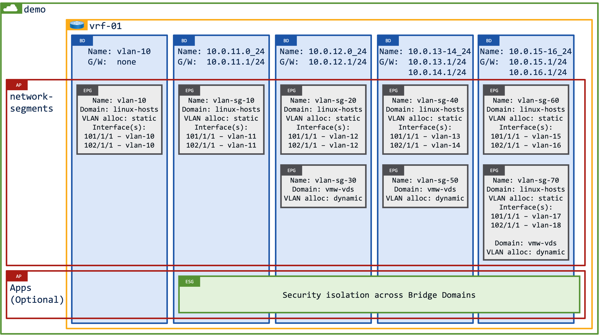

# Understanding ACI Building Blocks

Before jumping on the UI to start configuring your network it is worth taking a step back to consider the relationship between different objects that you'll be touching within your ACI tenants.

I guess the first thing to do is to understand the building blocks and what they actually do:

- **Tenant** - a tenant is simply an administrative boundary, you can think of it like a VPC in AWS. It generally makes sense to align tenants around a customer's business functions, for example a bank may have a tenant for "consumer finance" and another tenant for "commercial finance", or they may acutally break those tenants into smaller administrative boundaries - "consumer finance - production", "consumer finance - pre-production", "consumer finance - staging" etc.
- **VRF** - a VRF is the same as a VRF on any other router, it routes internally and externally (L3out in ACI terminology), it can only live inside a single tenant. The VRF can operate it either enforced mode (default), or unenforced mode. When operating in the default enforced mode communication on the VRF is blocked and is only permitted though the use of Contracts (ACLs). Switching between enforced mode and unenforced mode is a disruptive operation.
- **Bridge Domain** - a Bridge Domain (BD) is a VXLAN segment that is associated with (mapped to) a single VRF. A BD may or may not have associated gateway(s) i.e. a Bridge Domain can be considered to be either Layer 2 or Layer 3. When you configure a gateway on a BD it dynamically creates an SVI on the VRF.
- **Application Profile** - an Application Profile is simply a folder in which to configure your security groups. The security groups are either VLAN based (EPGs) or IP/MAC based (ESGs).
- **Endpoint Groups** - An Endpoint Group (EPG) classifies/accepts traffic coming into a given switch/interface/VLAN for security purposes. Contracts can be applied to/between EPGs to allow communication.
- **Endpoint Security Group** - An Endpoint Security Group (ESG) classifies traffic within a VRF by MAC/IP/EPG/Tag for security purposes. Contracts can be applied to/between ESGs to allow communication. 

ACI is able to abstract the different building blocks to build extremely flexible (or confusing) network designs.

## Bridge Domains and EPGs

A diagram always (hopefully) speaks a thousand words...!

In the diagram below you'll see how the building blocks hang together. There is a Tenant (demo) with a VRF (vrf-01). The VRF has 5x Bridge Domains each with one or more associated EPGs. 

Now what I should point out is that most (the vast majority) of customers will deploy a single BD:EPG design, in other words a single Subnet:VLAN design - more on that below.

    

- **BD: vlan-10** - this is a Layer 2 Bridge Domain which has a single EPG (**vlan-10**). 
    - **EPG: vlan-10** - this EPG is used for "linux" hosts and classifies/accepts traffic on VLAN10 on interface 101/1/1 and interface 102/1/1.
- **BD: 10.0.11.0_24** - this is a Layer 3 Bridge Domain with an SVI of 10.0.11.1/24, and a single EPG (**vlan-sg-10**). 
    - **EPG: vlan-sg-10** - this EPG is used for "linux" hosts and classifies/accepts traffic on VLAN10 on interface 101/1/1 and interface 102/1/1.
- **BD: 10.0.12.0_24** - this is a Layer 3 Bridge Domain with an SVI of 10.0.12.1/24, and it has two EPGS (**vlan-sg-20** and **vlan-sg-30**) which are isolated from each other. 
    - **EPG: vlan-sg-20** - this EPG uses static switch/interface/vlan to match traffic.
    - **EPG: vlan-sg-30** - this EPG is mapped to a VMware VDS and is dynamically allocated a VLAN.
- **BD: 10.0.13-14_24** - this is a Layer 3 Bridge Domain with 2x SVIs, 10.0.13.1/24 and 10.0.14.1/24. One SVI will be automatically defined as Primary, and the other SVI will be automatically defined as secondary. Now here's something to melt your mind...!! 
    - **EPG: vlan-sg-40** - endpoints will be mapped to vlan-sg-40 irrespective of whether they're on the 10.0.13.0 subnet or the 10.0.14.0 subnet **provided** that they match VLAN13 on 101/1/1 or VLAN14 on 102/1/1 i.e. it is entirely possible to map endpoints from different subnets (on the same BD) to the same security group. 
    - **EPG: vlan-sg-50** - this EPG is mapped to a VMware VDS and is dynamically allocated a VLAN.
- **BD: 10.0.15-16_24** - this is a Layer 3 Bridge Domain with 2x SVIs, 10.0.15.1/24 and 10.0.16.1/24. 
    - **EPG: vlan-sg-60** - this EPG is the same as the previous example, endpoints can be attached to VLAN15 or VLAN16, and they can be on the 10.0.15.0/24 subnet and/or the 10.0.16.0/24 subnet. 
    - **EPG: vlan-sg-70** - this EPG classifies endpoints from VLAN17 or VLAN18 irrespective of whether they're on the 10.0.15.0 subnet or the 10.0.16.0 subnet, plus it classifies endpoints from the VLAN which is dynamically allocated to the VMware VDS.

### Which is the best option...?

Generally speaking most customers create a single BD/EPG relationship, the reason for this design choice is twofold:

1. It's simple to understand as in a traditional network you always have a single VLAN/SVI realtionship, and whilst it's true that you can configure secondary SVIs, it quite rare to see that type of configuration outside of migration scenarios.
2. When you're migrating from a legacy network to ACI you'll have a single VLAN/SVI in the legacy world that you'll want to bring onto ACI.

Keeping things simple makes it easy to troubleshoot!

## Bridge Domains and ESGs

The fundamental difference between between EPGs and ESGs is that ESG operate across Bridge Domains in a VRF.

So what does this mean? 

Quite simply it means that you can build security groups irrespective of which BD/subnet an endpoint is attached to. 

Consider a scenario with a banking customer where you have a VRF with a number of Bridge Domains (subnets), each Bridge Domain has a single EPG - a simple, traditional design. The VRF subnets are not dedicated to specific business functions, and as such the subnets are shared between "consumer finance" and "commerical finance". 

The customer has a requirement to ringfence their workloads, using ESGs you can easily classify endpoints into two different ESGs giving you visibility and (optionally) security of the workloads.