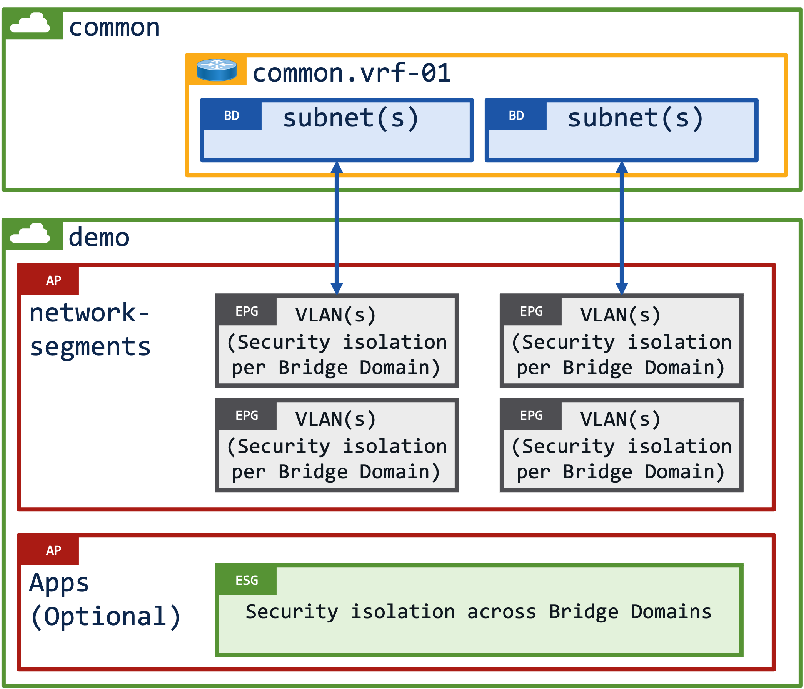
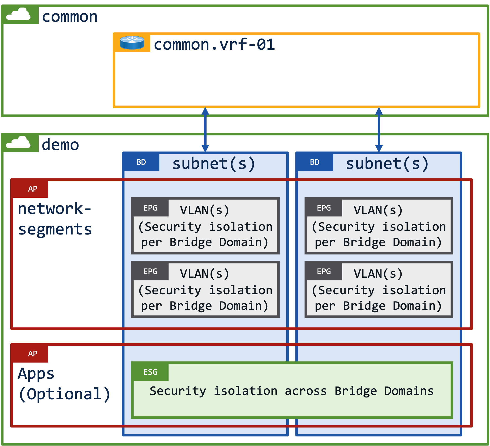
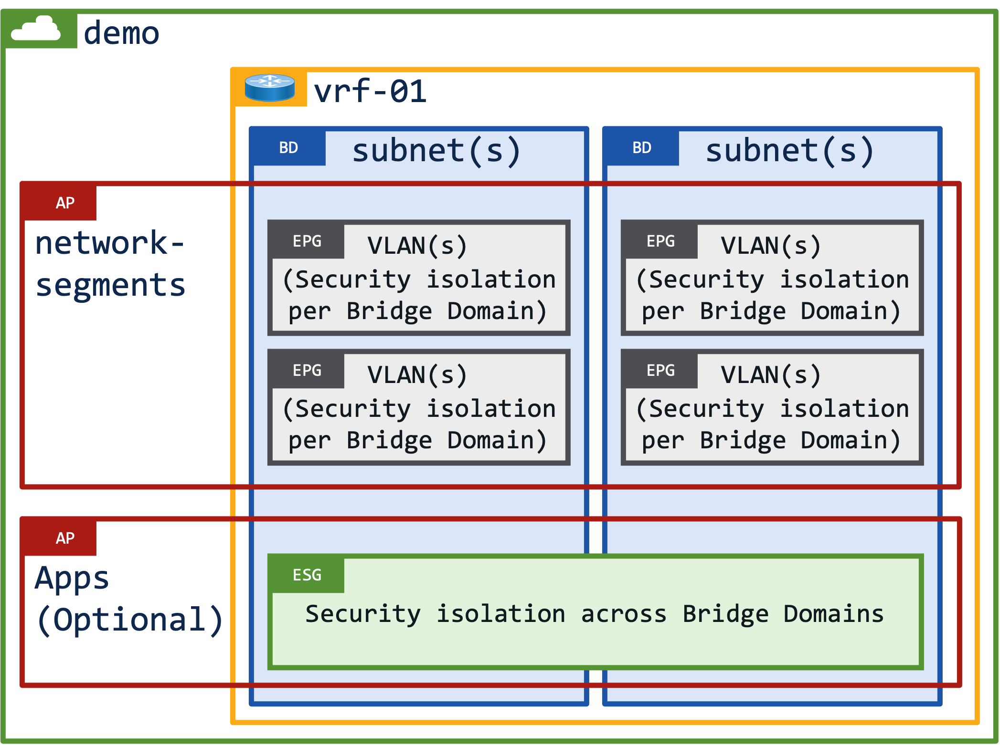
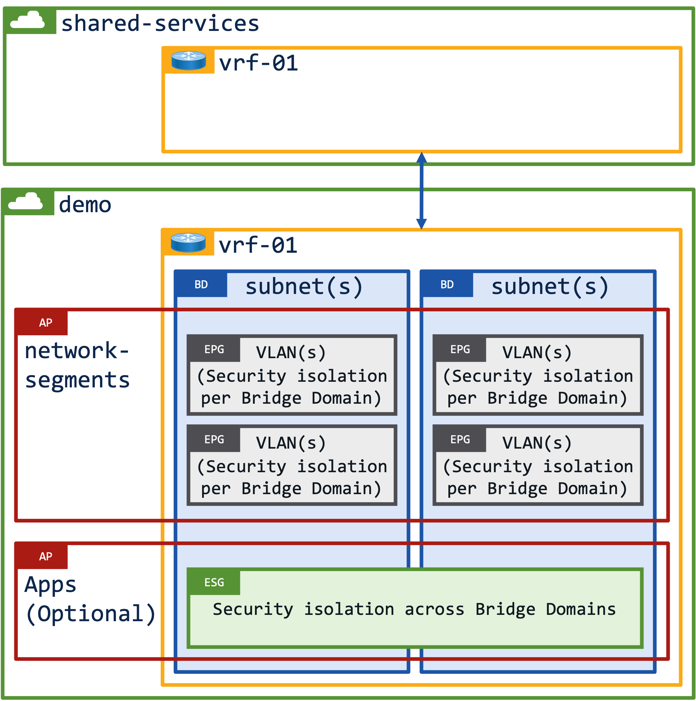
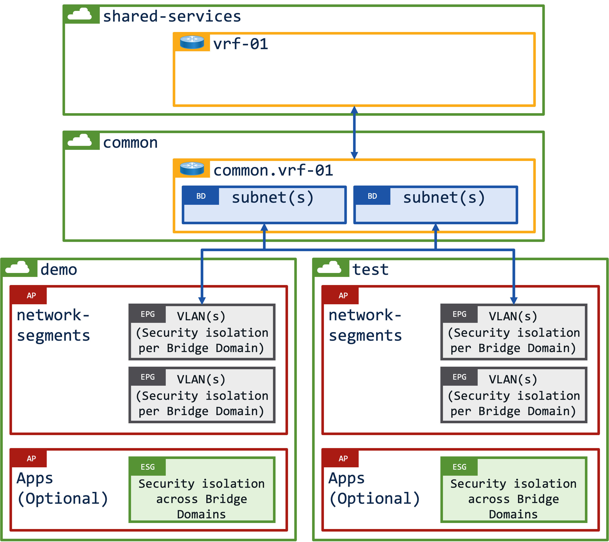

# Designing your tenants (draft)

Before exploring different tenant design options it would be worth taking a few minutes to review the securiy considerations when using [tenant common](../common-tenant/index.md). Aside from the security considerations ACI administrators should also consider prexfixing any object in tenant common with the "common." prefix so that they unique names on the fabric.

It is also worth understaning the security considerations when using [vzAny](../vzAny/index.md) as vzAny always includes the extEPG.

## Option 1 - All resources in tenant common

    <table class="row" style="display: table;margin: 0 auto">
        <tr>
            <td>
                

                    Option 1 uses the default tenant "common" for all objects. Whilst it is a valid design option it isn't something you'd typically see outside of a lab environment, and even then you still probably wouldn't (shouldn't) actually see it used in this way.
                

                

                    Tenant common should really only be used as a place to create shared objects (VRFs, BDs, Policies, Contracts, L3outs etc) so that they can be used by other tenants. You should always consider the potential security considerations when using tenant common.
                

            </td>
            <td>
                <td style="width:400px">
                
            </td>
        </tr>
    </table>

## Option 2 - Shared VRF, shared Bridge Domains

    <table class="row" style="display: table;margin: 0 auto">
        <tr>
            <td>
                

                    Option 2 allows you to share VRFs and Bridge Domains across different Tenants.
                

                

                    This design is often seen in migration scenarios when customers are migrating from their legacy infrastructure onto an ACI fabric, and they wish to place workloads into different tenants for admin purposes without changing the IP addresses of the workloads.
                

                

                    For example, a customer might have both production and pre-production workloads on the same subnets in their existing environment, as they migrate to ACI they can split the production and pre-production workloads into different admin domains/tenants.
                

            </td>
            <td>
                <td style="width:400px">
                
            </td>
        </tr>
    </table>

## Option 3 - Shared VRF, dedicated Bridge Domains

    <table class="row" style="display: table;margin: 0 auto">
        <tr>
            <td>
                

                    Option 3 allows you to have shared VRFs however the Bridge Domains (subnets) are dedicated to each Tenant.
                

                

                    This design is often seen when a customer wants to dedicate specific Bridge Domains (subnets) to specific tenants on the ACI fabric.
                

                

                    For example, a customer might have production and pre-production subnets in dedicated VRFs in their existing environment, as they migrate to ACI they can maintain their dedicated subnets by placing the Bridge Domains into the tenants, however the can simplify and reduce the number of VRFs they manage by using a shared VRF in tenant common.
                

            </td>
            <td>
                <td style="width:400px">
                
            </td>
        </tr>
    </table>

## Option 4 - All resources in "user" tenant

    <table class="row" style="display: table;margin: 0 auto">
        <tr>
            <td>
                

                    Option 4 places all the objects into dedicated Tenants.
                

                

                    A customer might have one Tenant, or they might have 50x Tenants - it entirely comes down to how many different administrative domains a customer wants to have. There's no right or wrong answer provided that you stay within the scale guides.
                

            </td>
            <td>
                <td style="width:400px">
                
            </td>
        </tr>
    </table>

## Option 5 - Shared services model

    <table class="row" style="display: table;margin: 0 auto">
        <tr>
            <td>
                

                    Option 5 is by far my favourite design, it uses a "shared-services" tenant for North/South routing, and it uses dedicted Tenants for workloads.
                

                

                    Ok, I guess the first thing to address is why should you use a dedicated "shared-services" tenant rather than tenant common?
                

                

                    The answer should already be obvious if you've read the securiy considerations when using <a href="../common-tenant/index.html">tenant common</a>. Any object that is created in tenant common can be used/consumed by other tenants, therefore you could have a potential security issue as a L3Out in tenant common can be implicitedly used by any other tenant, or a contract configured in tenant common could be used/consumed by anu other tenant.
                

                

                    If (on the other hand) you create a dedicated "shared-services" tenant you have to explcitedly allow connectivity to/from the "shared-services" tenant through route leaking and the exporting of contracts.
                

            </td>
            <td>
                <td style="width:400px">
                
            </td>
        </tr>
    </table>

## Option 6 - Shared services model with shared Bridge Domains 

    <table class="row" style="display: table;margin: 0 auto">
        <tr>
            <td>
                

                    Option 6 simply combines all the options that we've looked at previously. There is a dedicated tenant for "shared-services" with shared VRFs and Bridge Domains in tenant common.
                

                

                    You might well be thinking .... just why?
                

                

                    I put this design together for a large bank who were concerned about security (hence we used a "shared-services" design), however they were convinced that they might have the requirement to move workloads between different tenants without changing the workload IP addresses.
                

                

                    I did point out there are solutions such a DNS to overcome changing IP addresses, however they inisisted that this wasn't an option, hence this design template.
                

            </td>
            <td>
                <td style="width:400px">
                
            </td>
        </tr>
    </table>

