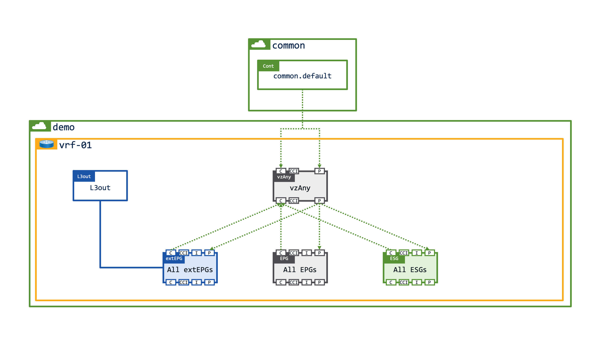

# Working with vzAny

What actually is vzAny?

In a nutshell vzAny is simply an EPG, but it's an EPG with a crucial difference - and that is that any contract which is applied to vzAny is applied to all EPGs, ESGs, and extEPGs within a given VRF.

To put it another way, when vzAny provides a contract it means that all EPGs, ESGs, and extEPGs are providers of the same contract. When vzAny consuumes a contract it means that all EPGs, ESGs, and extEPGs are consumers of the same contract.

It's also worth knowing that vzAny uses a pcTag/Class ID of zero (you can see this in the zoning rules), and it **cannot** be a contract provider in a shared services design.

## A sledgehammer to crack a nut

vzAny is often used to enable open communication within a VRF by providing and consuming the default contract from tenant common. This is an absolutely acceptable design, however it does open a potential security hole as vzAny will also apply to any external EPGs.

### vzAny in a single tenant

If you provide and consume the default (permit-any) contract on vzAny it will permit all traffic between all EPGs, ESGs, and extEPGs within the VRF as shown below. 

The potential issue is that, depending on the subnet scope on the external EPG, you will have also allowed traffic from any remote subnet to any workload on the fabric which may or may not be the intended outcome.

    

### vzAny in a single tenant with inside/outside VRFs

To mitigate the potential security risk of opening connectivity to all workloads on the VRF you could simply create 2x VRFs, one that is external facing, and one that is internal facing. Each tenant would have their own dedicated L3out and you would simply need to enable route leaking between the external and internal VRFs, and apply contracts from extEPGs to any internal EPGs/ESGs.

    

### vzAny in a shared services model with split tenants and VRFs

The final (and my preferred) option to mitigate the security risk that vzAny could pose is to create a Shared L3Out in a dedicated shared-services tenant. The shared L3out would provide inbound/outbound routing for all tenants on the fabric, and just like the previous example, you would need to enable route leaking between the external shared-services VRF, and the internal tenant VRF.

You will still need to apply contracts from the extEPGs in the shared services tenant to the required EPGs/ESGs in the "user" tenant, however what is slightly different in a shared services design is that contracts either need to be provisioned in tenant common, or (and once again, my preferred option) the contract should be created in the provider tenant and exported to the consumer tenant where the contract is consumed as a contract interface.

    

## Summary

The really great thing about vzAny is that it allows you to easily open up communication within a VRF. On the other hand, the really bad thing about vzAny is that it opens up communication within a VRF which might present a potential security risk.

I like to use vzAny to provide access to shared resources that need to be accessed by all endpoints in a VRF. For example if you have an EPG/ESG which provides your core services you could create a contract `permit-to-core-services` which is provided by your core services EPG/ESG and consumed by vzAny.

With the contract in place all EPGs/ESGs within the VRF also inplicitedly become consumers of the core services EPG.

    

I typically avoid placing services in tenant common unless I've got a really (really) good reason for putting something in tenant common - have a look at [working with tenant common](../common-tenant/index.md) for more details.