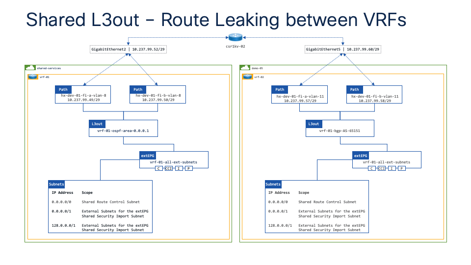

# Route leaking between OSPF and BGP

I had a customer request which was to configure a couple of ACI tenants, each with a L3out for external peering (no route leaking between tenants/VRFs). They wanted one L3out to run OSPF and one L3out to run BGP - a pretty straightforward setup.

I already had a "shared-services" tenant in my lab with a L3out running OSPF, so I added an SVI to the L3out which I used to connect to my external router - in this case my external router was a csr1kv. 

I then created another tenant with a L3out running BGP to the same csr1kv.

??? note "ACI and OSPF areas"

    When configuring a L3out for OSPF on ACI, you must put all the interfaces of the same OSPF process under the same L3out. 
    
    In other words, you cannot have 2x L3outs on the same VRF running OSPF for the same area.


<div class="row" style="display: table;margin: 0 auto">
    
</div>

The customer also had a secondary requirement which was to use dedicated VRFs on the external router to keep the tenant traffic completely isolated - more on this below.

These are the basic configuration steps that I put together to peer a csr1kv to ACI such that the csr1kv provides routing between the "shared-services" tenant running OSPF and the demo tenant running BGP.

The steps below focus only on the csr1kv configuration.

## Part 1 - Basic configuration

I added a dedicated management VRF on the csr1kv just so that I didn't cut my legs off when playing with different configuration options.

???+ success "`Management VRF`"

    ```console
    vrf definition management
    
    address-family ipv4
    exit-address-family

    interface GigabitEthernet1
    vrf forwarding management
    ip address 10.237.100.127 255.255.255.0
    negotiation auto
    no mop enabled
    no mop sysid

    ip route vrf management 0.0.0.0 0.0.0.0 10.237.100.1
    ```

I then configured OSPF on the csr1kv to peer with my upstream routers

In this case the upstream routers are my ACI Border Leafs and I'm peering OSPF with a L3out SVI in my shared-services tenant (`shared-services:vrf-01`).

???+ success "`OSPF Configuration`"

    ```console
    interface GigabitEthernet2
    ip address 10.237.99.52 255.255.255.248
    negotiation auto
    no mop enabled
    no mop sysid

    router ospf 1
    network 10.237.99.48 0.0.0.7 area 0.0.0.1
    ```

At this point my OSPF neighbours were up and working and I was receiving routes.

???+ success "`OSPF up and running`"

    ```console
    csr1kv-02#show ip ospf neighbor

    Neighbor ID     Pri   State           Dead Time   Address         Interface
    101.2.1.1         1   FULL/BDR        00:00:34    10.237.99.49    GigabitEthernet2
    102.2.1.1         1   FULL/DR         00:00:33    10.237.99.50    GigabitEthernet2

    csr1kv-02#sh ip route ospf

    <output truncated>

    Gateway of last resort is 10.237.99.50 to network 0.0.0.0

    O*E2    0.0.0.0/0   [110/1] via 10.237.99.50, 21:44:43, GigabitEthernet2
                        [110/1] via 10.237.99.49, 21:44:43, GigabitEthernet2
            10.0.0.0/8 is variably subnetted, 78 subnets, 9 masks
    O E2    10.0.1.0/24 [110/20] via 10.237.99.50, 21:44:43, GigabitEthernet2
                        [110/20] via 10.237.99.49, 21:44:43, GigabitEthernet2
    O E2    10.0.2.0/24 [110/20] via 10.237.99.50, 21:44:43, GigabitEthernet2
                        [110/20] via 10.237.99.49, 21:44:43, GigabitEthernet2
    O E2    10.0.3.0/24 [110/20] via 10.237.99.50, 21:44:43, GigabitEthernet2
                        [110/20] via 10.237.99.49, 21:44:43, GigabitEthernet2
    O E2    10.0.4.0/24 [110/20] via 10.237.99.50, 21:44:43, GigabitEthernet2

    <output truncated>
    ```

The next thing to configure was BGP peering from the csr1kv to the L3out SVI in my demo tenant (`demo:vrf-01`).

???+ success "`BGP Configuration`"

    ```console
    interface GigabitEthernet6
    ip address 10.237.99.84 255.255.255.248
    negotiation auto
    no mop enabled
    no mop sysid

    router bgp 65051
    bgp log-neighbor-changes
    neighbor 10.237.99.81 remote-as 65151
    neighbor 10.237.99.82 remote-as 65151
    
    address-family ipv4
    network 0.0.0.0
    neighbor 10.237.99.81 activate
    neighbor 10.237.99.82 activate
    exit-address-family
    ```

At this point my BGP neighbours were up and working and I was receiving routes.

???+ success "`BGP up and running`"

    ```console
    csr1kv-02#show ip bgp summary
    BGP router identifier 10.237.99.84, local AS number 65051
    BGP table version is 11, main routing table version 11
    8 network entries using 1984 bytes of memory
    15 path entries using 2040 bytes of memory
    2/2 BGP path/bestpath attribute entries using 576 bytes of memory
    1 BGP AS-PATH entries using 40 bytes of memory
    0 BGP route-map cache entries using 0 bytes of memory
    0 BGP filter-list cache entries using 0 bytes of memory
    BGP using 4640 total bytes of memory
    BGP activity 9/1 prefixes, 16/1 paths, scan interval 60 secs
    8 networks peaked at 15:48:22 Mar 14 2024 UTC (00:25:48.160 ago)

    Neighbor        V           AS MsgRcvd MsgSent   TblVer  InQ OutQ Up/Down  State/PfxRcd
    10.237.99.81    4        65151      77      70       11    0    0 00:56:00        7
    10.237.99.82    4        65151      76      69       11    0    0 00:55:44        7

    csr1kv-02#show ip route bgp

    <output truncated>

    Gateway of last resort is 10.237.99.50 to network 0.0.0.0

    B        10.0.1.0/24 [20/0] via 10.237.99.81, 00:31:01
    B        10.0.2.0/24 [20/0] via 10.237.99.81, 00:31:01
    B        10.0.3.0/24 [20/0] via 10.237.99.81, 00:31:01
    B        10.0.4.0/24 [20/0] via 10.237.99.81, 00:31:01
    B        10.0.5.0/24 [20/0] via 10.237.99.81, 00:31:01
    B        10.0.6.0/24 [20/0] via 10.237.99.81, 00:31:01
    B        10.0.7.0/24 [20/0] via 10.237.99.81, 00:31:01
    
    <output truncated>
    ```

Finally, I redistributed my OSPF routes into BGP and my BGP routes into OSPF.

???+ success "`Route redistribution`"

    ```console
    router ospf 1
    redistribute bgp 65051

    router bgp 65051
    address-family ipv4
    redistribute ospf 1 match external 2
    ```

I was now able to see routes in the VRF on my ACI fabric:

???+ success "`Routes learned on ACI`"

    ``` console
    aci-dev-01-apic-01# fabric 101-102 show ip route vrf demo:vrf-01
    ----------------------------------------------------------------
    Node 101 (aci-dev-01-leaf-101)
    ----------------------------------------------------------------
    IP Route Table for VRF "demo:vrf-01"
    '*' denotes best ucast next-hop
    '**' denotes best mcast next-hop
    '[x/y]' denotes [preference/metric]
    '%<string>' in via output denotes VRF <string>

    0.0.0.0/0, ubest/mbest: 1/0
        *via 10.237.99.234%shared-services:vrf-01, eth1/7, [20/1], 3d00h, bgp-65001, external, tag 65001, rwVnid: vxlan-2129920
    10.0.1.0/24, ubest/mbest: 1/0, attached, direct, pervasive
        *via 10.1.176.66%overlay-1, [1/0], 3d00h, static
    10.0.1.1/32, ubest/mbest: 1/0, attached, pervasive
        *via 10.0.1.1, vlan44, [0/0], 3d00h, local, local
    10.0.2.0/24, ubest/mbest: 1/0, attached, direct, pervasive
        *via 10.1.176.66%overlay-1, [1/0], 3d00h, static
    10.0.2.1/32, ubest/mbest: 1/0, attached, pervasive
        *via 10.0.2.1, vlan51, [0/0], 3d00h, local, local
    10.0.3.0/24, ubest/mbest: 1/0, attached, direct, pervasive
        *via 10.1.176.66%overlay-1, [1/0], 3d00h, static
    10.0.3.1/32, ubest/mbest: 1/0, attached, pervasive
        *via 10.0.3.1, vlan38, [0/0], 3d00h, local, local
    10.0.4.0/24, ubest/mbest: 1/0, attached, direct, pervasive
        *via 10.1.176.66%overlay-1, [1/0], 3d00h, static
    10.0.4.1/32, ubest/mbest: 1/0, attached, pervasive
        *via 10.0.4.1, vlan42, [0/0], 3d00h, local, local
    10.0.5.0/24, ubest/mbest: 1/0, attached, direct, pervasive
        *via 10.1.176.66%overlay-1, [1/0], 3d00h, static
    10.0.5.1/32, ubest/mbest: 1/0, attached, pervasive
        *via 10.0.5.1, vlan48, [0/0], 3d00h, local, local
    10.0.6.0/24, ubest/mbest: 1/0, attached, direct, pervasive
        *via 10.1.176.66%overlay-1, [1/0], 3d00h, static
    10.0.6.1/32, ubest/mbest: 1/0, attached, pervasive
        *via 10.0.6.1, vlan35, [0/0], 3d00h, local, local
    10.0.7.0/24, ubest/mbest: 1/0, attached, direct, pervasive
        *via 10.1.176.66%overlay-1, [1/0], 3d00h, static
    10.0.7.1/32, ubest/mbest: 1/0, attached, pervasive
        *via 10.0.7.1, vlan40, [0/0], 3d00h, local, local
    10.0.11.0/24, ubest/mbest: 1/0
        *via 10.237.99.84%demo:vrf-01, [20/20], 00:21:49, bgp-65001, external, tag 65151
    10.0.12.0/24, ubest/mbest: 1/0
        *via 10.237.99.84%demo:vrf-01, [20/20], 00:21:49, bgp-65001, external, tag 65151
    10.0.13.0/24, ubest/mbest: 1/0
        *via 10.237.99.84%demo:vrf-01, [20/20], 00:21:49, bgp-65001, external, tag 65151
    10.0.14.0/24, ubest/mbest: 1/0
        *via 10.237.99.84%demo:vrf-01, [20/20], 00:21:49, bgp-65001, external, tag 65151
    10.0.51.0/24, ubest/mbest: 1/0
        *via 10.237.99.84%demo:vrf-01, [20/20], 00:21:49, bgp-65001, external, tag 65151
    10.0.52.0/24, ubest/mbest: 1/0
        *via 10.237.99.84%demo:vrf-01, [20/20], 00:21:49, bgp-65001, external, tag 65151
    10.0.61.0/24, ubest/mbest: 1/0
        *via 10.237.99.84%demo:vrf-01, [20/20], 00:21:49, bgp-65001, external, tag 65151
    10.0.62.0/24, ubest/mbest: 1/0
        *via 10.237.99.84%demo:vrf-01, [20/20], 00:21:49, bgp-65001, external, tag 65151
    10.0.71.0/24, ubest/mbest: 1/0
        *via 10.237.99.84%demo:vrf-01, [20/20], 00:21:49, bgp-65001, external, tag 65151
    10.0.72.0/24, ubest/mbest: 1/0
        *via 10.237.99.84%demo:vrf-01, [20/20], 00:21:49, bgp-65001, external, tag 65151
    10.0.73.0/24, ubest/mbest: 1/0
        *via 10.237.99.84%demo:vrf-01, [20/20], 00:21:49, bgp-65001, external, tag 65151
    10.0.81.0/24, ubest/mbest: 1/0
    ```


## Part 2 - Tenant specific VRFs

With everything working as expected in the Global VRF the next step was to create a couple of VRFs on my external csr1kv.

I added a "shared-services" VRF to peer upstream to my shared-services VRF on ACI (`shared-services:vrf-01`), and I added a "demo" to peer downstream to my demo VRF on ACI (`demo:vrf-01`).

???+ success "`Create new VRFs and import/export routes`"

    ``` console
    vrf definition tn-shared-services
    rd 65000:100
    route-target export 65000:100
    route-target import 65000:100
    route-target import 65000:0
    
    address-family ipv4
    exit-address-family

    vrf definition tn-demo
    rd 65000:0
    route-target export 65000:0
    route-target import 65000:0
    route-target import 65000:100
    !
    address-family ipv4
    exit-address-family
    ```
I then added the interfaces to the respective VRFs.

???+ success "`Add the interfaces to the respective VRFs`"

    ``` console
    interface GigabitEthernet2
    vrf forwarding tn-shared-services
    ip address 10.237.99.52 255.255.255.248
    negotiation auto
    no mop enabled
    no mop sysid

    interface GigabitEthernet6
    vrf forwarding tn-demo
    ip address 10.237.99.84 255.255.255.248
    negotiation auto
    no mop enabled
    no mop sysid
    ```

Finally I configured the routing protocols.

???+ success "`Configure the routing protocols`"

    ``` console
    router ospf 1 vrf tn-shared-services
    capability vrf-lite
    redistribute bgp 65051
    network 10.237.99.48 0.0.0.7 area 0.0.0.1

    router bgp 65051
    bgp log-neighbor-changes

    address-family ipv4 vrf tn-shared-services
    network 0.0.0.0
    redistribute connected
    redistribute ospf 1 match internal external 2
    exit-address-family

    address-family ipv4 vrf tn-demo
    network 10.237.99.80 mask 255.255.255.248
    neighbor 10.237.99.81 remote-as 65151
    neighbor 10.237.99.81 activate
    neighbor 10.237.99.82 remote-as 65151
    neighbor 10.237.99.82 activate
    exit-address-family
    ```

??? note "Redistributing a default route"

    If a default route has been learned as an external route from OSPF it will **not** be redistributed into BGP using `redistribute ospf 1 match external 2`. 
    
    To advertise the default route I had to add the `network 0.0.0.0` to my tn-shared-services VRF.
    
    Another way to advertise a default route would have been to use `default-information originate`. 
    
    This would always create a default route and advertise it via BGP to neighbours specified with `neighbor x.x.x.x default-originate`.

I was now able to see routes in the VRF on my ACI fabric:

???+ success "`Routes learned on ACI`"

    ``` console
    aci-dev-01-apic-01# fabric 101-102 show ip route vrf demo:vrf-01
    ----------------------------------------------------------------
    Node 101 (aci-dev-01-leaf-101)
    ----------------------------------------------------------------
    IP Route Table for VRF "demo:vrf-01"
    '*' denotes best ucast next-hop
    '**' denotes best mcast next-hop
    '[x/y]' denotes [preference/metric]
    '%<string>' in via output denotes VRF <string>

    0.0.0.0/0, ubest/mbest: 1/0
        *via 10.237.99.84%demo:vrf-01, [20/0], 00:11:04, bgp-65001, external, tag 65151
    10.0.1.0/24, ubest/mbest: 1/0, attached, direct, pervasive
        *via 10.1.176.66%overlay-1, [1/0], 3d02h, static
    10.0.1.1/32, ubest/mbest: 1/0, attached, pervasive
        *via 10.0.1.1, vlan44, [0/0], 3d02h, local, local
    10.0.2.0/24, ubest/mbest: 1/0, attached, direct, pervasive
        *via 10.1.176.66%overlay-1, [1/0], 3d02h, static
    10.0.2.1/32, ubest/mbest: 1/0, attached, pervasive
        *via 10.0.2.1, vlan51, [0/0], 3d02h, local, local
    10.0.3.0/24, ubest/mbest: 1/0, attached, direct, pervasive
        *via 10.1.176.66%overlay-1, [1/0], 3d02h, static
    10.0.3.1/32, ubest/mbest: 1/0, attached, pervasive
        *via 10.0.3.1, vlan38, [0/0], 3d02h, local, local
    10.0.4.0/24, ubest/mbest: 1/0, attached, direct, pervasive
        *via 10.1.176.66%overlay-1, [1/0], 3d02h, static
    10.0.4.1/32, ubest/mbest: 1/0, attached, pervasive
        *via 10.0.4.1, vlan42, [0/0], 3d02h, local, local
    10.0.5.0/24, ubest/mbest: 1/0, attached, direct, pervasive
        *via 10.1.176.66%overlay-1, [1/0], 3d02h, static
    10.0.5.1/32, ubest/mbest: 1/0, attached, pervasive
        *via 10.0.5.1, vlan48, [0/0], 3d02h, local, local
    10.0.6.0/24, ubest/mbest: 1/0, attached, direct, pervasive
        *via 10.1.176.66%overlay-1, [1/0], 3d02h, static
    10.0.6.1/32, ubest/mbest: 1/0, attached, pervasive
        *via 10.0.6.1, vlan35, [0/0], 3d02h, local, local
    10.0.7.0/24, ubest/mbest: 1/0, attached, direct, pervasive
        *via 10.1.176.66%overlay-1, [1/0], 3d02h, static
    10.0.7.1/32, ubest/mbest: 1/0, attached, pervasive
        *via 10.0.7.1, vlan40, [0/0], 3d02h, local, local
    10.0.11.0/24, ubest/mbest: 1/0
        *via 10.237.99.84%demo:vrf-01, [20/0], 00:32:30, bgp-65001, external, tag 65151
    10.0.12.0/24, ubest/mbest: 1/0
        *via 10.237.99.84%demo:vrf-01, [20/0], 00:32:30, bgp-65001, external, tag 65151
    10.0.13.0/24, ubest/mbest: 1/0
        *via 10.237.99.84%demo:vrf-01, [20/0], 00:32:30, bgp-65001, external, tag 65151
    10.0.14.0/24, ubest/mbest: 1/0
        *via 10.237.99.84%demo:vrf-01, [20/0], 00:32:30, bgp-65001, external, tag 65151
    10.0.71.0/24, ubest/mbest: 1/0
        *via 10.237.99.84%demo:vrf-01, [20/0], 00:32:30, bgp-65001, external, tag 65151
    10.0.72.0/24, ubest/mbest: 1/0
        *via 10.237.99.84%demo:vrf-01, [20/0], 00:32:30, bgp-65001, external, tag 65151
    10.0.73.0/24, ubest/mbest: 1/0
        *via 10.237.99.84%demo:vrf-01, [20/0], 00:32:30, bgp-65001, external, tag 65151
    10.0.81.0/24, ubest/mbest: 1/0
        *via 10.237.99.84%demo:vrf-01, [20/0], 00:32:30, bgp-65001, external, tag 65151
    ```

## Part 3 - ACI configuration with NAC

I used NAC to automate the ACI configuration so that I didn't spend my time configuring things manually on the GUI.

Below is just a dump of the NAC configuration.

??? success "`ACI configuration`"
    ``` yaml
    ---
    apic:
    tenants:
        - name: demo
        description: Routable IP range 10.0.1-7.x

        policies:
            dhcp_relay_policies:
            - name: dhcp.uktme.cisco.com
                description: "dhcp.uktme.cisco.com"
                providers:
                - ip: 10.237.97.133
                    type: external_epg
                    tenant: demo
                    l3out: demo.vrf-01-bgp-AS-65151
                    external_endpoint_group: all-external-subnets

        filters:
            - name: 'icmp'
            entries:
                - name: 'icmp'
                protocol: icmp

            - name: 'permit-src-any-dst-any'
            entries:
                - name: 'permit-src-any-dst-any'
                ethertype: unspecified

        contracts:
            - name: intra-tenant
            description: vzAny is contract Consumer and Provider
            scope: context
            subjects:
                - name: permit-src-any-dst-any
                filters: 
                    - filter: permit-src-any-dst-any

            - name: permit-to-vzAny
            description: vzAny is contract Provider
            scope: tenant
            subjects:
                - name: permit-src-any-dst-any
                filters:
                    - filter: permit-src-any-dst-any

        vrfs:
            - name: vrf-01
            description: configured with NAC
            # alias: internal-vrf-01

            contracts:
                providers:
                - permit-to-vzAny
                # consumers:

        l3outs:
            - name: demo.vrf-01-bgp-AS-65151
            description: configured with NAC
            # alias: external-vrf
            vrf: vrf-01
            domain: demo.vrf-01

            node_profiles:
                - name: border-leafs
                nodes:
                    - node_id: 101
                    router_id: 101.2.0.1
                    - node_id: 102
                    router_id: 102.2.0.1

                interface_profiles:
                    - name: hx-dev-01-fi-a-vlan-34
                    interfaces:
                        - node_id: 101
                        channel: hx-dev-01-fi-a
                        vlan: 34
                        svi: true
                        ip: 10.237.99.81/29
                        mtu: 1500
                        bgp_peers:
                            - ip: 10.237.99.84/29
                            remote_as: 65051
                            local_as: 65151
                            allow_self_as: false
                            as_override: false
                            disable_peer_as_check: false
                            next_hop_self: false
                            send_community: false
                            send_ext_community: false
                            allowed_self_as_count: 3
                            bfd: false
                            disable_connected_check: false
                            ttl: 1
                            remove_all_private_as: false
                            remove_private_as: false
                            replace_private_as_with_local_as: false
                            unicast_address_family: true
                            multicast_address_family: true
                            admin_state: true
                            as_propagate: none

                    - name: hx-dev-01-fi-b-vlan-34
                    interfaces:
                        - node_id: 102
                        channel: hx-dev-01-fi-b
                        vlan: 34
                        svi: true
                        ip: 10.237.99.82/29
                        mtu: 1500                      
                        bgp_peers:
                            - ip: 10.237.99.84/29
                            remote_as: 65051
                            local_as: 65151
                            allow_self_as: false
                            as_override: false
                            disable_peer_as_check: false
                            next_hop_self: false
                            send_community: false
                            send_ext_community: false
                            allowed_self_as_count: 3
                            bfd: false
                            disable_connected_check: false
                            ttl: 1
                            remove_all_private_as: false
                            remove_private_as: false
                            replace_private_as_with_local_as: false
                            unicast_address_family: true
                            multicast_address_family: true
                            admin_state: true
                            as_propagate: none

            external_endpoint_groups:
                - name: all-external-subnets
                subnets:
                    - prefix: 0.0.0.0/0
                    shared_route_control: false
                    import_security: true

                contracts:
                    consumers:
                    - permit-to-vzAny

        bridge_domains:
            # - name: 6.6.6.0_24
            #   description: PBR subnet
            #   # alias: internal-vrf-01
            #   unknown_unicast: proxy
            #   vrf: vrf-01
            #   subnets:
            #     - ip: 6.6.6.1/24
            #       public: false
            #       private: true
            #       shared: false
            #       nd_ra_prefix: false

            - name: 10.0.1.0_24
            # alias: internal-vrf-01
            unknown_unicast: proxy
            vrf: vrf-01
            subnets:
                - ip: 10.0.1.1/24
                public: true
                # private: false
                shared: false
                nd_ra_prefix: false
            l3outs:
                - demo.vrf-01-bgp-AS-65151
            dhcp_labels:
                - dhcp_relay_policy: dhcp.uktme.cisco.com

            - name: 10.0.2.0_24
            # alias: internal-vrf-01
            unknown_unicast: proxy
            vrf: vrf-01
            subnets:
                - ip: 10.0.2.1/24
                public: true
                # private: false
                shared: false
                nd_ra_prefix: false
            l3outs:
                - demo.vrf-01-bgp-AS-65151
            dhcp_labels:
                - dhcp_relay_policy: dhcp.uktme.cisco.com

            - name: 10.0.3.0_24
            # alias: internal-vrf-01
            unknown_unicast: proxy
            vrf: vrf-01
            subnets:
                - ip: 10.0.3.1/24
                public: true
                # private: false
                shared: false
                nd_ra_prefix: false
            l3outs:
                - demo.vrf-01-bgp-AS-65151
            dhcp_labels:
                - dhcp_relay_policy: dhcp.uktme.cisco.com

            - name: 10.0.4.0_24
            # alias: internal-vrf-01
            unknown_unicast: proxy
            vrf: vrf-01
            subnets:
                - ip: 10.0.4.1/24
                public: true
                # private: false
                shared: false
                nd_ra_prefix: false
            l3outs:
                - demo.vrf-01-bgp-AS-65151
            dhcp_labels:
                - dhcp_relay_policy: dhcp.uktme.cisco.com

            - name: 10.0.5.0_24
            # alias: internal-vrf-01
            unknown_unicast: proxy
            vrf: vrf-01
            subnets:
                - ip: 10.0.5.1/24
                public: true
                # private: false
                shared: false
                nd_ra_prefix: false
            l3outs:
                - demo.vrf-01-bgp-AS-65151
            dhcp_labels:
                - dhcp_relay_policy: dhcp.uktme.cisco.com

            - name: 10.0.6.0_24
            # alias: internal-vrf-01
            unknown_unicast: proxy
            vrf: vrf-01
            subnets:
                - ip: 10.0.6.1/24
                public: true
                # private: false
                shared: false
                nd_ra_prefix: false
            l3outs:
                - demo.vrf-01-bgp-AS-65151
            dhcp_labels:
                - dhcp_relay_policy: dhcp.uktme.cisco.com

            - name: 10.0.7.0_24
            # alias: internal-vrf-01
            unknown_unicast: proxy
            vrf: vrf-01
            subnets:
                - ip: 10.0.7.1/24
                public: true
                # private: false
                shared: false
                nd_ra_prefix: false
            l3outs:
                - demo.vrf-01-bgp-AS-65151
            dhcp_labels:
                - dhcp_relay_policy: dhcp.uktme.cisco.com

        application_profiles:
            - name: 'network-segments'
            description: EPGs provide the VLAN backing for application workloads
            endpoint_groups:      
                # - name: '10.237.100.0_24'
                #   # alias: common.vrf-01
                #   bridge_domain: '10.237.100.x_24'
                #   vmware_vmm_domains:
                #     - name: 'ucsc-c220m5-vds-01'
                #       u_segmentation: true
                #       deployment_immediacy: immediate
                #       resolution_immediacy: immediate

                - name: '10.0.1.0_24'
                # alias: internal-vrf-01
                bridge_domain: '10.0.1.0_24'
                vmware_vmm_domains:
                    - name: 'hx-dev-01-vds-01'
                    # primary_vlan: 1243
                    # secondary_vlan: 1244  
                    # u_segmentation: true
                    deployment_immediacy: immediate
                    resolution_immediacy: immediate
        
                - name: '10.0.2.0_24'
                # alias: internal-vrf-01
                bridge_domain: '10.0.2.0_24'
                vmware_vmm_domains:
                    - name: 'hx-dev-01-vds-01'
                    # primary_vlan: 1245
                    # secondary_vlan: 1246  
                    # u_segmentation: true
                    deployment_immediacy: immediate
                    resolution_immediacy: immediate
            
                - name: '10.0.3.0_24'
                # alias: internal-vrf-01
                bridge_domain: '10.0.3.0_24'
                vmware_vmm_domains:
                    - name: 'hx-dev-01-vds-01'
                    # primary_vlan: 1247
                    # secondary_vlan: 1248 
                    # u_segmentation: true
                    deployment_immediacy: immediate
                    resolution_immediacy: immediate
        
                - name: '10.0.4.0_24'
                # alias: internal-vrf-01
                bridge_domain: '10.0.4.0_24'
                vmware_vmm_domains:
                    - name: 'hx-dev-01-vds-01'
                    # primary_vlan: 1249
                    # secondary_vlan: 1250 
                    # u_segmentation: true
                    deployment_immediacy: immediate
                    resolution_immediacy: immediate

                - name: '10.0.5.0_24'
                # alias: internal-vrf-01
                bridge_domain: '10.0.5.0_24'
                vmware_vmm_domains:
                    - name: 'hx-dev-01-vds-01'
                    # primary_vlan: 1251
                    # secondary_vlan: 1252
                    # u_segmentation: true
                    deployment_immediacy: immediate
                    resolution_immediacy: immediate

                - name: '10.0.6.0_24'
                # alias: internal-vrf-01
                bridge_domain: '10.0.6.0_24'
                vmware_vmm_domains:
                    - name: 'hx-dev-01-vds-01'
                    # primary_vlan: 1253
                    # secondary_vlan: 1254  
                    # u_segmentation: true
                    deployment_immediacy: immediate
                    resolution_immediacy: immediate

                - name: '10.0.7.0_24'
                # alias: internal-vrf-01
                bridge_domain: '10.0.7.0_24'
                vmware_vmm_domains:
                    - name: 'hx-dev-01-vds-01'
                    # primary_vlan: 1255
                    # secondary_vlan: 1256 
                    # u_segmentation: true
                    deployment_immediacy: immediate
                    resolution_immediacy: immediate 
    ```